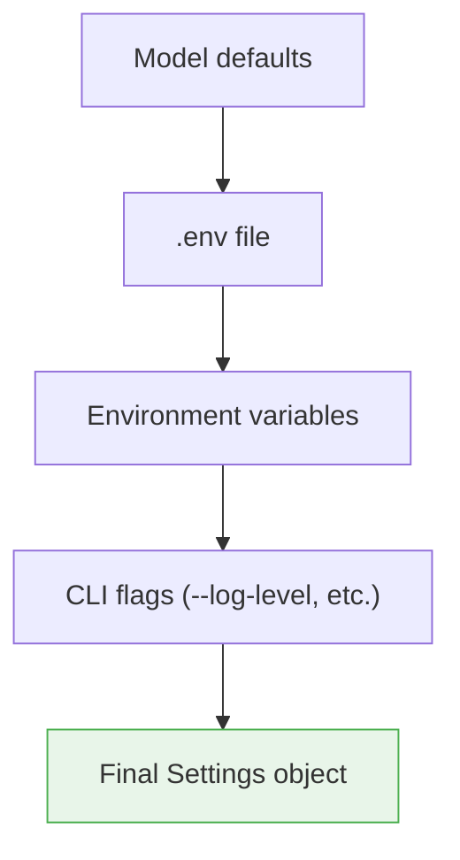

# Configuration

Cosalette uses **pydantic-settings** for type-safe, layered configuration.
Environment variables, `.env` files, and CLI flags are merged into a single
validated `Settings` object before the application starts.

## Configuration Hierarchy

Settings are resolved with the following precedence (highest wins):

```
CLI flags  >  Environment variables  >  .env file  >  Model defaults
```



This follows the **Twelve-Factor App** methodology (Factor III — Config):
configuration lives in the environment, not in code.

## Settings Schema

The root `Settings` class composes two sub-models:

```python
class Settings(BaseSettings):
    model_config = SettingsConfigDict(
        env_nested_delimiter="__",
        env_file=".env",
        env_file_encoding="utf-8",
    )

    mqtt: MqttSettings = Field(default_factory=MqttSettings)
    logging: LoggingSettings = Field(default_factory=LoggingSettings)
```

### MqttSettings

| Field                | Type             | Default       | Description                         |
|----------------------|------------------|---------------|-------------------------------------|
| `host`               | `str`            | `"localhost"` | Broker hostname or IP               |
| `port`               | `int` (1–65535)  | `1883`        | Broker port                         |
| `username`            | `str \| None`    | `None`        | Authentication username             |
| `password`            | `SecretStr \| None` | `None`     | Authentication password (masked)    |
| `client_id`           | `str`            | `""`          | MQTT client ID (auto-set by App)    |
| `reconnect_interval`  | `float` (> 0)   | `5.0`         | Seconds between reconnection attempts |
| `qos`                 | `0 \| 1 \| 2`   | `1`           | Default Quality of Service level    |
| `topic_prefix`        | `str`            | `""`          | Root topic prefix (auto-set by App) |

### LoggingSettings

| Field          | Type                                          | Default  | Description                       |
|----------------|-----------------------------------------------|----------|-----------------------------------|
| `level`        | `"DEBUG" \| "INFO" \| "WARNING" \| "ERROR" \| "CRITICAL"` | `"INFO"` | Root log level |
| `format`       | `"json" \| "text"`                            | `"json"` | Output format (JSON lines or text) |
| `file`         | `str \| None`                                 | `None`   | Optional log file path            |
| `max_file_size_mb` | `int` (≥ 1)                              | `10`     | Max log file size (MB) before rotation |
| `backup_count` | `int` (≥ 0)                                  | `3`      | Rotated log file generations      |

## Nested Delimiter

Pydantic-settings uses `__` (double underscore) as the nested delimiter. Nested
model fields map to environment variables with `__` separating levels:

```bash
# Environment variables
export MQTT__HOST=broker.local
export MQTT__PORT=1883
export MQTT__USERNAME=admin
export MQTT__PASSWORD=secret
export LOGGING__LEVEL=DEBUG
export LOGGING__FORMAT=text
```

These map directly to the Python object hierarchy:

```python
settings.mqtt.host        # "broker.local"
settings.mqtt.port        # 1883
settings.logging.level    # "DEBUG"
settings.logging.format   # "text"
```

## `.env` File Support

A `.env` file in the working directory is loaded automatically. The file path
can be overridden via the `--env-file` CLI flag:

```bash title=".env"
MQTT__HOST=broker.local
MQTT__PORT=1883
MQTT__USERNAME=user
MQTT__PASSWORD=s3cret
LOGGING__LEVEL=INFO
```

```bash
# Use a different env file
myapp --env-file /etc/myapp/production.env
```

!!! tip "`.env` files are optional"
    If no `.env` file exists, pydantic-settings silently continues with
    environment variables and model defaults. This is the expected case in
    container deployments where all config comes from environment variables.

## SecretStr for Credentials

The `password` field uses pydantic's `SecretStr` type, which prevents
accidental credential leakage:

```python
password: SecretStr | None = Field(default=None)
```

- `repr()` shows `SecretStr('**********')` instead of the actual value
- `str()` returns `'**********'`
- `settings.mqtt.password.get_secret_value()` returns the real string
- JSON serialisation masks the value by default

!!! warning "Never log settings objects directly"
    Even with `SecretStr`, logging the full `settings.mqtt` object with
    a custom serialiser could leak credentials. The `SecretStr` guard
    is best-effort — prefer logging individual fields.

## Application Extension Pattern

Framework consumers subclass `Settings` to add application-specific fields
and an `env_prefix`:

```python
from cosalette._settings import Settings, MqttSettings
from pydantic import Field
from pydantic_settings import SettingsConfigDict

class VeluxSettings(Settings):
    model_config = SettingsConfigDict(
        env_prefix="VELUX_",  # (1)!
        env_nested_delimiter="__",
        env_file=".env",
        env_file_encoding="utf-8",
    )

    serial_port: str = Field(
        default="/dev/ttyUSB0",
        description="Serial port for KLF200 gateway",
    )
    poll_interval: float = Field(
        default=30.0,
        description="Seconds between status polls",
    )
```

1. With `env_prefix="VELUX_"`, environment variables become
   `VELUX_MQTT__HOST`, `VELUX_SERIAL_PORT`, etc.

!!! info "Sub-models use `BaseModel`, not `BaseSettings`"
    `MqttSettings` and `LoggingSettings` are `pydantic.BaseModel` subclasses
    composed into the root `BaseSettings`. Only the root class participates
    in environment variable loading — sub-models exist for structural
    organisation.

## CLI Override Integration

The Typer-based CLI exposes framework-level flags that take precedence over
all other sources:

```bash
myapp --log-level DEBUG --log-format text --dry-run --env-file prod.env
```

These overrides are applied *after* settings are loaded from the environment:

```python
if log_level is not None:
    settings.logging = settings.logging.model_copy(
        update={"level": log_level.upper()},
    )
```

---

## See Also

- [Architecture](architecture.md) — how settings feed into the composition root
- [Logging](logging.md) — `LoggingSettings` fields and their effects
- [MQTT Topics](mqtt-topics.md) — `topic_prefix` usage in topic layout
- [ADR-003 — Configuration System](../adr/ADR-003-configuration-system.md)
