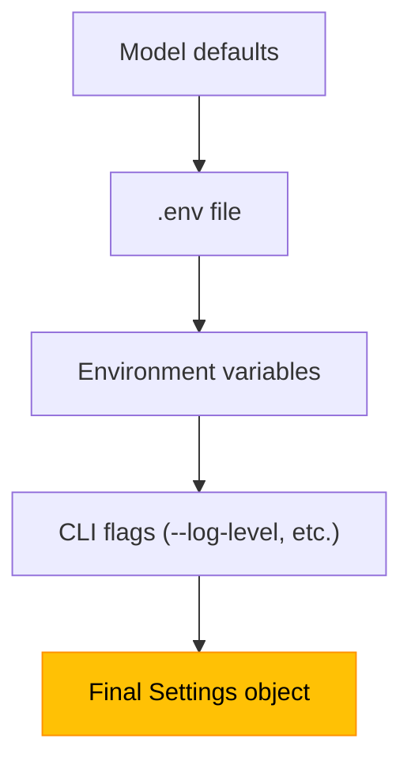

# Configuration Model

Cosalette uses **pydantic-settings** for type-safe, layered configuration.
Environment variables, `.env` files, and CLI flags are merged into a single
validated `Settings` object before the application starts.

## Configuration Hierarchy

Settings are resolved with the following precedence (highest wins):

```
CLI flags  >  Environment variables  >  .env file  >  Model defaults
```


```mermaid
graph TB
    A["Model defaults"] --> B[".env file"]
    B --> C["Environment variables"]
    C --> D["CLI flags (--log-level, etc.)"]
    D --> E["Final Settings object"]

    style E fill:#FFC105,stroke:#FF9100,color:#000000
```

The complete environment-variable table and `.env` file loading rules live in
the [Settings reference](../reference/settings.md#environment-variables).

## Application Extension Pattern

Framework consumers subclass `Settings` to add application-specific fields
and an `env_prefix`:

```python
from cosalette._settings import Settings, MqttSettings
from pydantic import Field
from pydantic_settings import SettingsConfigDict

class VeluxSettings(Settings):
    model_config = SettingsConfigDict(
        env_prefix="VELUX_",  # (1)!
        env_nested_delimiter="__",
        env_file=".env",
        env_file_encoding="utf-8",
    )

    serial_port: str = Field(
        default="/dev/ttyUSB0",
        description="Serial port for KLF200 gateway",
    )
    poll_interval: float = Field(
        default=30.0,
        description="Seconds between status polls",
    )
```

1. With `env_prefix="VELUX_"`, environment variables become
   `VELUX_MQTT__HOST`, `VELUX_SERIAL_PORT`, etc.

!!! info "Sub-models use `BaseModel`, not `BaseSettings`"
    `MqttSettings` and `LoggingSettings` are `pydantic.BaseModel` subclasses
    composed into the root `BaseSettings`. Only the root class participates
    in environment variable loading — sub-models exist for structural
    organisation.

The reason to subclass rather than configure externally is isolation:
each application's variables are namespaced under its own prefix, so
`GAS2MQTT_MQTT__HOST` and `VELUX_MQTT__HOST` never collide even when
multiple apps share a host.

See [Configure Your Application](../guides/configuration.md) for the full
how-to: validators, `SecretStr`, `field_validator`, and decorator arguments.

## CLI Override Integration

The Typer-based CLI exposes framework-level flags that take precedence over
all other sources:

```bash
myapp --log-level DEBUG --log-format text --dry-run --env-file prod.env
```

These overrides are applied *after* settings are loaded from the environment:

```python
if log_level is not None:
    settings.logging = settings.logging.model_copy(
        update={"level": log_level.upper()},
    )
```

---

## See Also

- [Configure Your Application](../guides/configuration.md) — subclassing, validators, SecretStr
- [Settings reference](../reference/settings.md) — env-var table, `.env` loading, mkdocstrings
- [Architecture](architecture.md) — how settings feed into the composition root
- [Logging](logging.md) — `LoggingSettings` fields and their effects
- [MQTT Topics](mqtt-topics.md) — `topic_prefix` usage in topic layout
- [ADR-003 — Configuration System](../adr/ADR-003-configuration-system.md)
