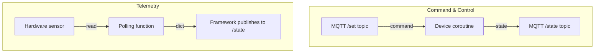

# Device Archetypes

Cosalette recognises two fundamental device archetypes, distilled from analysis
of eight real-world IoT bridge projects. Every device in an IoT-to-MQTT bridge
falls into one of these categories — or can be expressed as a composition of both.

## The Two Archetypes

| Aspect              | Command & Control (`@app.device`) | Telemetry (`@app.telemetry`)       |
|---------------------|-----------------------------------|------------------------------------|
| **Direction**       | Bidirectional                     | Unidirectional (device → broker)   |
| **Execution model** | Long-running coroutine            | Framework-managed polling loop     |
| **Inbound commands**| `@ctx.on_command` handler         | Not applicable                     |
| **State publishing**| Manual via `ctx.publish_state()`  | Automatic — return a `dict`        |
| **Typical devices** | GPIO relays, WiFi bulbs, BLE CSAFE rowers | BLE sensors, I²C temperature probes |



## Command & Control Devices

A command & control device is a **long-running coroutine** that owns its own
event loop. It can receive inbound commands via MQTT, interact with hardware
adapters, and publish state whenever it changes.

```python
@app.device("blind")  # (1)!
async def blind(ctx: cosalette.DeviceContext) -> None:
    driver = ctx.adapter(VeluxPort)  # (2)!

    @ctx.on_command  # (3)!
    async def handle(topic: str, payload: str) -> None:
        position = int(payload)
        await driver.set_position(position)
        await ctx.publish_state({"position": position})

    while not ctx.shutdown_requested:  # (4)!
        status = await driver.poll_status()
        await ctx.publish_state(status)
        await ctx.sleep(30)
```

1. `@app.device` registers the function as a command & control device named `"blind"`.
2. Resolve a hardware adapter via the [hexagonal port system](hexagonal.md).
3. `@ctx.on_command` registers a handler for `{prefix}/blind/set` messages.
4. The `while not ctx.shutdown_requested` / `ctx.sleep()` pattern is the idiomatic
   main loop — `sleep()` returns early on shutdown without raising.

!!! info "Coroutine ownership"
    The framework creates one `asyncio.Task` per device. Your coroutine runs
    concurrently alongside other devices. When shutdown is signalled, the
    framework cancels the task after the current iteration completes.

### Command Routing

When a message arrives on `{prefix}/blind/set`, the framework's
`TopicRouter` extracts the device name and dispatches the payload to the
handler registered via `@ctx.on_command`. See [MQTT Topics](mqtt-topics.md)
for the full topic layout.

## Telemetry Devices

A telemetry device is a **simple function** that reads a sensor and returns
a dict. The framework handles the polling schedule and MQTT publication.

The simplest form takes zero arguments:

```python
@app.telemetry("temperature", interval=60)  # (1)!
async def temperature() -> dict[str, object]:
    reading = await read_i2c_sensor()  # (2)!
    return {"celsius": reading.temp, "humidity": reading.rh}  # (3)!
```

1. Framework calls this function every 60 seconds.
2. Your code reads the hardware (or adapter).
3. The returned dict is JSON-serialised and published to `{prefix}/temperature/state`
   as a retained QoS 1 message.

When you need infrastructure access (adapters, settings, MQTT publishing), declare
a `ctx: DeviceContext` parameter and the framework injects it:

```python
@app.telemetry("temperature", interval=60)
async def temperature(ctx: cosalette.DeviceContext) -> dict[str, object]:
    sensor = ctx.adapter(SensorPort)
    return {"celsius": sensor.read_temp()}
```

### Telemetry Internals

Under the hood, `@app.telemetry` is syntactic sugar for a polling loop inside
the framework:

```python
# Simplified framework internals (not user code)
async def _run_telemetry(reg, ctx, error_publisher):
    while not ctx.shutdown_requested:
        try:
            result = await reg.func(ctx)
            await ctx.publish_state(result)
        except asyncio.CancelledError:
            raise  # Let shutdown cancellation propagate
        except Exception as exc:
            await error_publisher.publish(exc, device=reg.name)
        await ctx.sleep(reg.interval)
```

The framework wraps each telemetry call in error isolation — a single failed
reading is logged and published as an error, but the polling loop continues.

## Manual Telemetry Escape Hatch

Some sensors require complex polling logic — backoff, adaptive intervals,
or multi-step reads. For these cases, use `@app.device` with a manual loop:

```python
@app.device("complex_sensor")
async def complex_sensor(ctx: cosalette.DeviceContext) -> None:
    adapter = ctx.adapter(SensorPort)
    interval = 10.0

    while not ctx.shutdown_requested:
        try:
            data = await adapter.read()
            await ctx.publish_state(data)
            interval = 10.0  # reset on success
        except SensorTimeoutError:
            interval = min(interval * 2, 300)  # exponential backoff
        await ctx.sleep(interval)
```

!!! tip "When to use which"
    Use `@app.telemetry` for straightforward read-and-return sensors.
    Use `@app.device` when you need custom error handling, adaptive intervals,
    or inbound command support alongside telemetry.

## Mixed Applications

Most real bridges combine both archetypes:

```python
app = cosalette.App(name="home2mqtt", version="1.0.0")

@app.device("relay")
async def relay(ctx: cosalette.DeviceContext) -> None:
    """Bidirectional: accepts on/off commands, publishes state."""
    ...

@app.telemetry("outdoor_temp", interval=120)
async def outdoor_temp() -> dict[str, object]:
    """Unidirectional: reads a BLE thermometer every 2 minutes."""
    ...

@app.telemetry("indoor_temp", interval=60)
async def indoor_temp(ctx: cosalette.DeviceContext) -> dict[str, object]:
    """Unidirectional: reads an I²C sensor every minute (uses ctx for adapter)."""
    ...

app.run()
```

## Error Isolation

Each device runs in its own `asyncio.Task` with independent error boundaries.
A crash in one device does **not** take down others:

- **Command & control**: if the coroutine raises, the error is logged and
  published to the device's error topic. Other devices continue running.
- **Telemetry**: if one polling cycle raises, the error is published and the
  next cycle runs on schedule.

This isolation is fundamental to daemon reliability — a flaky BLE sensor
should never prevent a Velux motor from responding to commands.

!!! warning "CancelledError is special"
    `asyncio.CancelledError` is *not* caught by the error isolation layer.
    It propagates normally to allow graceful shutdown via task cancellation.

## Naming Constraints

Device names must be unique across *both* archetypes. Registering a telemetry
device with the same name as a command & control device raises `ValueError`
at import time:

```python
@app.device("sensor")
async def sensor_control(ctx): ...

@app.telemetry("sensor", interval=10)  # ValueError: Device name 'sensor' is already registered
async def sensor_data(ctx): ...
```

This constraint exists because device names are used as MQTT topic segments
(`{prefix}/{name}/state`) and must be unambiguous.

---

## See Also

- [Architecture](architecture.md) — composition root and registration API
- [MQTT Topics](mqtt-topics.md) — topic layout for state, commands, and errors
- [Error Handling](error-handling.md) — structured error payloads per device
- [Lifecycle](lifecycle.md) — when devices start, run, and stop
- [Testing](testing.md) — testing device functions with `DeviceContext` fixtures
- [ADR-010 — Device Archetypes](../adr/ADR-010-device-archetypes.md)
