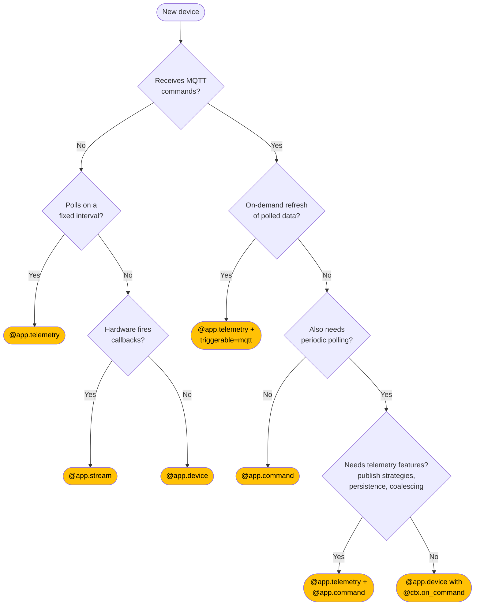

# Device Archetypes

Cosalette recognises three primary device archetypes — **Command**, **Telemetry**,
and **Device** — along with two companion patterns, **Streaming** and **Periodic**.
Every device in an IoT-to-MQTT bridge maps to one of these patterns, or a composition
of them.

## Archetype comparison

| Aspect              | Command (`@app.command`)             | Telemetry (`@app.telemetry`)       | Device (`@app.device`)             |
|---------------------|--------------------------------------|------------------------------------|------------------------------------|
| **Direction**       | Bidirectional                        | Unidirectional (default) or bidirectional (`triggerable="mqtt"`) | Bidirectional or unidirectional    |
| **Execution model** | Per-message dispatch                 | Framework-managed polling loop     | Long-running async generator       |
| **Inbound commands**| Automatic — handler receives them    | Optional via `triggerable="mqtt"` | `ctx.commands()` or `@ctx.on_command` |
| **State publishing**| Automatic — return a `dict`          | Automatic — return a `dict`        | Manual via `ctx.publish_state()`   |
| **Publish control** | Not applicable                       | `publish=` strategies              | Manual (your loop logic)           |
| **Reaction boundary** | After successful return            | After successful return            | After each `yield`                 |
| **Typical devices** | GPIO relays, WiFi bulbs, simple actuators | BLE sensors, I²C temperature probes | State machines, combined patterns |
| **Scheduling**      | On-demand (per message)                  | `interval=` or `schedule=` (cron)  | Manual via `ctx.sleep()` / `ctx.sleep_until()` |

=== "Command (`@app.command`)"

    ```mermaid
    graph LR
        A[MQTT /set topic] -->|message| B[Handler function]
        B -->|return dict| C[Framework publishes to /state]
    ```

=== "Telemetry (`@app.telemetry`)"

    ```mermaid
    graph LR
        D[Hardware sensor] -->|read| E[Polling function]
        E -->|return dict| F[Framework publishes to /state]
    ```

=== "Device (`@app.device`)"

    ```mermaid
    graph LR
        A[MQTT /set topic] -->|command| B[Device coroutine]
        B -->|publish_state| C[MQTT /state topic]
    ```

## Archetype pages

Each archetype has a dedicated concept page with handler anatomy, mechanics, and
design notes:

| Archetype | Page | Primary use |
|-----------|------|-------------|
| `@app.command` | [Command & Control](command.md) | MQTT command handlers |
| `@app.telemetry` | [Telemetry](telemetry.md) | Sensor polling with schedule |
| `@app.device` | [@app.device](device.md) | Custom loops and state machines |
| `@app.stream` | [Streaming](streaming.md) | Push-callback hardware (BLE, serial) |
| `@app.periodic` | [Periodic](periodic.md) | Background side-effect tasks |

## When to Use Which

Use this decision matrix to choose the right decorator:

| Need                                        | Decorator                    |
| ------------------------------------------- | ---------------------------- |
| React to MQTT commands, publish state        | `@app.command` ✓             |
| Poll a sensor on a fixed interval            | `@app.telemetry` ✓           |
| Poll often, publish selectively              | `@app.telemetry` + `publish=` ✓ |
| Suppress duplicate readings                  | `@app.telemetry` + `OnChange()` ✓ |
| On-demand refresh + polling fallback          | `@app.telemetry` + `triggerable="mqtt"` ✓ |
| Wake a polled entity from in-process code    | `@app.telemetry` + `triggerable="local"` ✓ |
| Hardware-fired callbacks (BLE, serial, HID)  | `@app.stream` ✓              |
| Command + periodic hardware polling          | `@app.telemetry` + `@app.command` or `@app.device` |
| Custom event loop or state machine           | `@app.device` (escape hatch) |
| Time-of-day-aligned polling (e.g. 06:00)     | `@app.telemetry` + `schedule=` or `@app.device` + `ctx.sleep_until()` |
| Adaptive intervals or backoff                | `@app.device` (manual loop)  |

`@app.command` and `@app.telemetry` are the **recommended** decorators for the
vast majority of devices. With publish strategies, `@app.telemetry` now covers
use cases that previously required `@app.device` — like polling frequently but
publishing only on change. Use `@app.device` only when you need capabilities
that the simpler decorators cannot provide (adaptive intervals, state machines,
or combined command + telemetry behaviour).

## Choosing an Archetype

Use this decision tree to find the right decorator for your device:


```mermaid
graph TD
    Start([New device]) --> Q1{Receives MQTT<br/>commands?}

    Q1 -->|No| Q2{Polls on a<br/>fixed interval?}
    Q2 -->|Yes| T(["@app.telemetry"])
    Q2 -->|No| Q2b{Hardware fires<br/>callbacks?}
    Q2b -->|Yes| S(["@app.stream"])
    Q2b -->|No| D1(["@app.device"])

    Q1 -->|Yes| Q1a{On-demand refresh<br/>of polled data?}
    Q1a -->|Yes| TT(["@app.telemetry +<br/>triggerable=mqtt"])
    Q1a -->|No| Q3{Also needs<br/>periodic polling?}
    Q3 -->|No| C(["@app.command"])
    Q3 -->|Yes| Q4{Needs telemetry features?<br/>publish strategies,<br/>persistence, coalescing}
    Q4 -->|Yes| TC(["@app.telemetry +<br/>@app.command"])
    Q4 -->|No| D2(["@app.device with<br/>@ctx.on_command"])

    style T fill:#FFC105,color:#000000
    style D1 fill:#FFC105,color:#000000
    style C fill:#FFC105,color:#000000
    style TT fill:#FFC105,color:#000000
    style TC fill:#FFC105,color:#000000
    style D2 fill:#FFC105,color:#000000
    style S fill:#FFC105,color:#000000
```

**`@app.command`**
:   WiFi smart plug, GPIO relay

**`@app.telemetry`**
:   BLE thermometer, I²C humidity sensor

**`@app.telemetry` + `@app.command`**
:   Hot water controller with periodic temp reads and target temp commands
    (see [ADR-019](../adr/ADR-019-scoped-name-uniqueness.md))

**`@app.device`**
:   Complex state machine, sensor with adaptive backoff, custom event loop

## Mixed Applications

Most real bridges combine multiple archetypes:

```python
app = cosalette.App(name="home2mqtt", version="1.0.0")

@app.command("relay")
async def handle_relay(
    payload: str, ctx: cosalette.DeviceContext
) -> dict[str, object]:
    """Bidirectional: accepts on/off commands, returns state."""
    ...

@app.telemetry("outdoor_temp", interval=120)
async def outdoor_temp() -> dict[str, object]:
    """Unidirectional: reads a BLE thermometer every 2 minutes."""
    ...

@app.telemetry("indoor_temp", interval=60)
async def indoor_temp(ctx: cosalette.DeviceContext) -> dict[str, object]:
    """Unidirectional: reads an I²C sensor every minute (uses ctx for adapter)."""
    ...

app.run()
```

## Error Isolation

Each device runs in its own `asyncio.Task` with independent error boundaries.
A crash in one device does **not** take down others:

- **Command (`@app.command`)**: if the handler raises, the error is logged and
  published to the error topic. Subsequent commands are dispatched normally.
- **Device (`@app.device`)**: if the coroutine raises, the error is logged and
  published to the device's error topic. Other devices continue running.
- **Telemetry**: if one polling cycle raises, the error is published and the
  next cycle runs on schedule.

This isolation is fundamental to daemon reliability — a flaky BLE sensor
should never prevent an actuator motor from responding to commands.

!!! warning "CancelledError is special"
    `asyncio.CancelledError` is *not* caught by the error isolation layer.
    It propagates normally to allow graceful shutdown via task cancellation.

## Naming Constraints

Device names must be unique **within each registration type**. Two telemetry
registrations or two command registrations cannot share the same name, because
they would conflict on the same MQTT topic suffix.

However, a `@app.telemetry` and a `@app.command` registration **can** share the
same name — they publish to different MQTT suffixes (`/state` vs `/set`) and the
framework creates a shared `DeviceContext` for both. This enables the ADR-002
topic layout where a single device segment holds both state and command topics:

```python
import cosalette

@app.telemetry("hot_water", interval=30)
async def read_temps(ctx: cosalette.DeviceContext) -> dict[str, object]: ...

@app.command("hot_water")  # Same name — allowed (telemetry + command)
async def set_temp(payload: str, ctx: cosalette.DeviceContext) -> dict[str, object]: ...

# Result:
#   {app}/hot_water/state   ← telemetry publishes here
#   {app}/hot_water/set     ← command subscribes here
```

`@app.device` registrations remain globally unique — the device archetype already
handles both state and commands, so collisions with any other type are rejected:

```python
@app.device("sensor")
async def sensor_loop(ctx: cosalette.DeviceContext): ...

@app.telemetry("sensor", interval=10)  # ValueError: name conflicts with device registration
async def sensor_data(ctx: cosalette.DeviceContext) -> dict[str, object]: ...
```

See [ADR-019](../adr/ADR-019-scoped-name-uniqueness.md) for the full decision
record.

Device names are used as MQTT topic segments (`{prefix}/{name}/state`) and must
be unambiguous within their topic suffix.

### The Read/Write Split Pattern

When `@app.telemetry` and `@app.command` share a device name they model a
**resource with distinct read and write paths** — the telemetry handler
_produces_ state, the command handler _accepts mutations_. This is the
correct cosalette pattern for bidirectional devices where reading and writing
require different code paths.

```python
import cosalette

@app.telemetry("gas_counter", interval=60, triggerable=True)
async def read_counter(ctx: cosalette.DeviceContext) -> dict[str, object]:
    """Read impulse count; also fires on demand when /set receives a message."""
    return {"impulses": ctx.adapter(GasMeterPort).read_impulses()}


@app.command("gas_counter")   # same name — distinct MQTT suffix
async def write_counter(
    payload: str, ctx: cosalette.DeviceContext
) -> dict[str, object]:
    """Accept counter reset or offset mutations."""
    await ctx.adapter(GasMeterPort).set_offset(int(payload))
    return {"impulses": ctx.adapter(GasMeterPort).read_impulses()}
```

**Topic layout:**

| Topic                           | Direction | Handler             |
| ------------------------------- | --------- | ------------------- |
| `{prefix}/gas_counter/state`    | outbound  | telemetry publishes |
| `{prefix}/gas_counter/set`      | inbound   | command subscribes  |

This is different from `triggerable="mqtt"` alone — an MQTT trigger source causes a
message on `/set` to re-fire the _read_ handler immediately (no mutation). The
read/write split uses `@app.command` for mutations and keeps the telemetry
handler as a pure reader.

For a full walkthrough and contract metadata examples, see the
[Contract-First Route Design](../guides/contract-first-route-design.md) guide.

### Root Devices (Unnamed)

When `name` is omitted, the device publishes to root-level topics —
`{prefix}/state` instead of `{prefix}/{device}/state`. This is ideal
for single-device apps where a device segment would be redundant:

```python
# Named device — publishes to weather2mqtt/sensor/state
@app.telemetry("sensor", interval=30)
async def sensor() -> dict[str, object]: ...

# Root device — publishes to weather2mqtt/state
@app.telemetry(interval=30)
async def sensor() -> dict[str, object]: ...
```

At most **one** root device is allowed per app. Mixing root and named
devices is supported but discouraged — the framework logs a warning.

---

## Streaming

`@app.stream` bridges hardware that delivers data via callbacks — BLE characteristic
notifications, serial port events, HID input reports — into idiomatic async iteration.
The framework manages the port lifecycle; the handler iterates a `Stream[T]`.

See [Streaming](streaming.md) for the full concept explanation, including the
`StreamablePort` protocol and the push-vs-pull mental model.

## Periodic tasks

`@app.periodic` registers a background coroutine that runs on a fixed interval with
no MQTT output. It accompanies device handlers as a side-effect partner — buffer
flushing, watchdog pings, cache warming.

See [Periodic](periodic.md) for the concept and companion pattern.

---

---

## See Also

- [Architecture](architecture.md) — composition root and registration API
- [MQTT Topics](mqtt-topics.md) — topic layout for state, commands, and errors
- [Error Handling](error-handling.md) — structured error payloads per device
- [Lifecycle](lifecycle.md) — when devices start, run, and stop
- [Testing](testing.md) — testing device functions with `DeviceContext` fixtures
- [Publish Strategies](publish-strategies.md) — publishing control concepts
- [Signal Filters](signal-filters.md) — handler-level data transformations
- [ADR-010 — Device Archetypes](../adr/ADR-010-device-archetypes.md)
- [ADR-013 — Telemetry Publish Strategies](../adr/ADR-013-telemetry-publish-strategies.md)
- [ADR-032 — Cron Scheduling & Wall-Clock Sleep](../adr/ADR-032-sleep-until-wall-clock-scheduling.md)
- [ADR-038 — Deferred enabled= for Decorator Registrations](../adr/ADR-038-deferred-enabled-for-decorator-registrations.md)
- [ADR-041 — Periodic Background Tasks](../adr/ADR-041-periodic-background-tasks.md)
- [ADR-042 — Streaming Protocol](../adr/ADR-042-streaming-protocol-streamableport-and-stream-t.md)
- [Stream Continuous Sensor Data](../guides/streaming.md)
