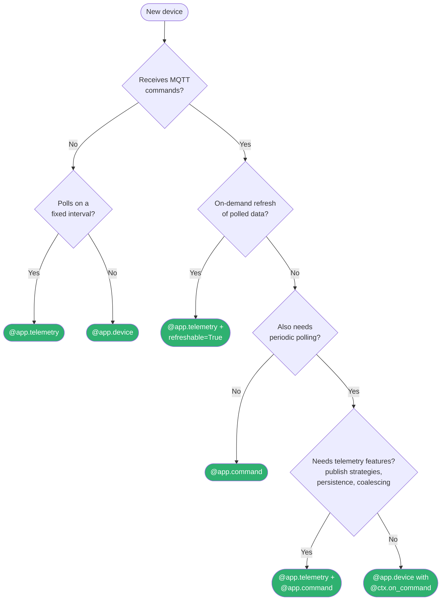

# Device Archetypes

Cosalette recognises three device archetypes. Every device in an IoT-to-MQTT bridge
falls into one of these categories — or can be expressed as a composition of them.

## Device Archetypes

| Aspect              | Command (`@app.command`)             | Telemetry (`@app.telemetry`)       | Device (`@app.device`)             |
|---------------------|--------------------------------------|------------------------------------|------------------------------------|
| **Direction**       | Bidirectional                        | Unidirectional (default) or bidirectional (`triggerable=True`) | Bidirectional or unidirectional    |
| **Execution model** | Per-message dispatch                 | Framework-managed polling loop     | Long-running coroutine             |
| **Inbound commands**| Automatic — handler receives them    | Optional via `triggerable=True`    | `ctx.commands()` or `@ctx.on_command` |
| **State publishing**| Automatic — return a `dict`          | Automatic — return a `dict`        | Manual via `ctx.publish_state()`   |
| **Publish control** | Not applicable                       | `publish=` strategies              | Manual (your loop logic)           |
| **Typical devices** | GPIO relays, WiFi bulbs, simple actuators | BLE sensors, I²C temperature probes | State machines, combined patterns |
| **Scheduling**      | On-demand (per message)                  | `interval=` or `schedule=` (cron)  | Manual via `ctx.sleep()` / `ctx.sleep_until()` |

=== "Command (`@app.command`)"

    ```mermaid
    graph LR
        A[MQTT /set topic] -->|message| B[Handler function]
        B -->|return dict| C[Framework publishes to /state]
    ```

=== "Telemetry (`@app.telemetry`)"

    ```mermaid
    graph LR
        D[Hardware sensor] -->|read| E[Polling function]
        E -->|return dict| F[Framework publishes to /state]
    ```

=== "Device (`@app.device`)"

    ```mermaid
    graph LR
        A[MQTT /set topic] -->|command| B[Device coroutine]
        B -->|publish_state| C[MQTT /state topic]
    ```

## Command & Control Devices

Command devices receive MQTT commands and publish state back. The `@app.command`
decorator is the **recommended** approach — it registers a simple handler function
that the framework calls on each inbound message.

```python
@app.command("blind")  # (1)!
async def handle_blind(
    payload: str, ctx: cosalette.DeviceContext  # (2)!
) -> dict[str, object]:  # (3)!
    driver = ctx.adapter(VeluxPort)
    position = int(payload)
    await driver.set_position(position)
    return {"position": position}  # (4)!
```

1. `@app.command` registers a handler for `{prefix}/blind/set` messages.
2. `payload` is optional and injected by name from the MQTT message; `ctx` is injected by type annotation. Declare only what you need.
3. Returning a `dict` auto-publishes to `{prefix}/blind/state`.
4. No closure, no main loop, no `nonlocal` — just a function.

### When to Use `@app.device` Instead

For devices that need a **long-running coroutine** — periodic hardware polling,
custom event loops, state machines, or combined command + telemetry behaviour —
use `@app.device` with `ctx.commands()`:

```python
@app.device("blind")  # (1)!
async def blind(ctx: cosalette.DeviceContext) -> None:
    driver = ctx.adapter(VeluxPort)

    async for cmd in ctx.commands(timeout=30):  # (2)!
        if cmd is None:
            status = await driver.poll_status()
            await ctx.publish_state(status)
        else:  # (3)!
            position = int(cmd.payload)
            await driver.set_position(position)
            await ctx.publish_state({"position": position})
```

1. `@app.device` registers the function as a long-running coroutine.
2. `ctx.commands(timeout=30)` drives the loop — yields `None` every 30 seconds for periodic work, or a `Command` when one arrives on `{prefix}/blind/set`.
3. Commands carry `payload`, `topic`, `sub_topic`, and `timestamp` fields.

!!! info "Coroutine ownership"
    The framework creates one `asyncio.Task` per `@app.device`. Your coroutine runs
    concurrently alongside other devices. When shutdown is signalled, the
    framework cancels the task after the current iteration completes.

### Command Routing

When a message arrives on `{prefix}/blind/set`, the framework's
`TopicRouter` extracts the device name and dispatches to the registered
handler (`@app.command`), the command queue (`ctx.commands()`), or callback
(`@ctx.on_command`). Sub-topic commands (`{prefix}/blind/calibrate/set`)
are routed to their specific handler. See [MQTT Topics](mqtt-topics.md) for
the full topic layout.

## Telemetry Devices

A telemetry device is a **simple function** that reads a sensor and returns
a dict. The framework handles the polling schedule and MQTT publication.

The simplest form takes zero arguments:

```python
@app.telemetry("temperature", interval=60)  # (1)!
async def temperature() -> dict[str, object]:
    reading = await read_i2c_sensor()  # (2)!
    return {"celsius": reading.temp, "humidity": reading.rh}  # (3)!
```

1. Framework calls this function every 60 seconds.
2. Your code reads the hardware (or adapter).
3. The returned dict is JSON-serialised and published to `{prefix}/temperature/state`
   as a retained QoS 1 message.

When you need infrastructure access (adapters, settings, MQTT publishing), declare
a `ctx: DeviceContext` parameter and the framework injects it:

```python
@app.telemetry("temperature", interval=60)
async def temperature(ctx: cosalette.DeviceContext) -> dict[str, object]:
    sensor = ctx.adapter(SensorPort)
    return {"celsius": sensor.read_temp()}
```

Telemetry devices are normally poll-only, but adding `refreshable=True` (or `triggerable=True` for legacy) makes them
also respond to inbound MQTT commands — see the
[Triggerable Telemetry](../guides/telemetry-device.md#triggerable-telemetry) guide.

### Telemetry Internals

Under the hood, `@app.telemetry` is syntactic sugar for a polling loop inside
the framework:

```python
# Simplified TelemetryRunner.run_telemetry (see _telemetry_runner.py)
async def run_telemetry(self, reg, ctx, error_publisher):
    last_published = None
    last_error_type = None
    while not ctx.shutdown_requested:
        try:
            result = await reg.func(ctx)
            if result is None:
                await ctx.sleep(reg.interval)
                continue
            strategy = reg.publish_strategy
            should_publish = (
                last_published is None          # First → always
                or strategy is None             # No strategy → always
                or strategy.should_publish(result, last_published)
            )
            if should_publish:
                await ctx.publish_state(result)
                last_published = result
                if strategy is not None:
                    strategy.on_published()
            if last_error_type is not None:
                last_error_type = None  # Recovery
        except asyncio.CancelledError:
            raise  # Let shutdown cancellation propagate
        except Exception as exc:
            if type(exc) is not last_error_type:
                await error_publisher.publish(exc, device=reg.name)
            last_error_type = type(exc)
        await ctx.sleep(reg.interval)
```

The framework wraps each telemetry call in error isolation with **state-transition
deduplication** — the first error of each type is published, but repeated same-type
errors are suppressed to prevent flooding. When the sensor recovers, the framework
logs recovery and restores the device health status.

### Publish Strategies

By default, the framework publishes every probe result. **Publish strategies**
decouple the probing frequency from the publishing frequency — probe often,
publish selectively:

```python
from cosalette import Every, OnChange

@app.telemetry("temperature", interval=10, publish=Every(seconds=300))
async def temperature() -> dict[str, object]:
    return {"celsius": await read_sensor()}
```

Here, `interval=10` means the sensor is **probed** every 10 seconds, but
`Every(seconds=300)` ensures state is **published** at most once every 5
minutes. This is useful when you want responsive readings locally (e.g. for
EWMA smoothing) but don't need to flood MQTT.

For threshold modes, composition operators, and the full strategy reference, see
[Publish Strategies](publish-strategies.md).

### Coalescing Groups

When multiple telemetry handlers share a physical resource — such as a serial bus,
SPI interface, or rate-limited API — they can be grouped into a shared execution
window using the `group=` parameter:

```python
@app.telemetry("outdoor", interval=300, group="optolink")
async def outdoor(port: OptolinkPort) -> dict[str, object]:
    return await port.read_signals(["outdoor_temp"])

@app.telemetry("hotwater", interval=300, group="optolink")
async def hotwater(port: OptolinkPort) -> dict[str, object]:
    return await port.read_signals(["hot_water_temp"])
```

Handlers in the same group are managed by a shared **tick-aligned scheduler**. At
t=0 all grouped handlers fire together; at subsequent ticks only those whose interval
divides evenly into the elapsed time fire. This reduces resource sessions from N
(one per handler) down to 1 per coinciding tick, eliminates timing drift, and enables
adapter session sharing.

Each handler retains its own publish strategy, error isolation, persistence policy,
and init function — `group=` is purely an execution scheduling hint.

See [ADR-018](../adr/ADR-018-coalescing-groups.md) for the full design rationale.

### Deferred `enabled=`

Sometimes a device should only be registered when the app's settings dictate it.
All three decorator forms (`@app.telemetry`, `@app.device`, `@app.command`) accept
`enabled=` as a **callable** that receives the resolved `Settings` instance and
returns a `bool`:

```python
@app.telemetry(
    "magnetometer",
    interval=lambda s: s.poll_interval,
    enabled=lambda s: s.enable_debug_device,  # resolved at bootstrap
)
async def magnetometer(mag: MagnetometerPort) -> dict[str, object]:
    reading = mag.read()
    return {"bx": reading.bx, "by": reading.by, "bz": reading.bz}
```

When `enabled=` is a callable, the framework defers the decision to the bootstrap
phase — after settings are resolved — alongside
[`interval=` deferred resolution](../adr/ADR-020-deferred-interval-resolution.md).
Devices where the callable returns `False` are silently dropped from the registry
before MQTT wiring begins.

This preserves the **fully-declarative `main.py`** style: every device is visible
at module level, and no `@app.on_configure` boilerplate is needed just to
conditionally register one device.

!!! note "Imperative add_*() methods"
    `app.add_telemetry()`, `app.add_device()`, and `app.add_command()` only accept
    `enabled: bool`. Inside `@app.on_configure`, settings are already available,
    so a callable is unnecessary.

See [ADR-038](../adr/ADR-038-deferred-enabled-for-decorator-registrations.md) for
the full decision record.

## Manual Telemetry Escape Hatch

Some sensors require complex polling logic — backoff, adaptive intervals,
or multi-step reads. For these cases, use `@app.device` with a manual loop:

```python
@app.device("complex_sensor")
async def complex_sensor(ctx: cosalette.DeviceContext) -> None:
    adapter = ctx.adapter(SensorPort)
    interval = 10.0

    while not ctx.shutdown_requested:
        try:
            data = await adapter.read()
            await ctx.publish_state(data)
            interval = 10.0  # reset on success
        except SensorTimeoutError:
            interval = min(interval * 2, 300)  # exponential backoff
        await ctx.sleep(interval)
```

!!! tip "When to use which"
    Use `@app.telemetry` for straightforward read-and-return sensors.
    Use `@app.device` when you need custom error handling, adaptive intervals,
    or inbound command support alongside telemetry.

## When to Use Which

Use this decision matrix to choose the right decorator:

| Need                                        | Decorator                    |
| ------------------------------------------- | ---------------------------- |
| React to MQTT commands, publish state        | `@app.command` ✓             |
| Poll a sensor on a fixed interval            | `@app.telemetry` ✓           |
| Poll often, publish selectively              | `@app.telemetry` + `publish=` ✓ |
| Suppress duplicate readings                  | `@app.telemetry` + `OnChange()` ✓ |
| On-demand refresh + polling fallback          | `@app.telemetry` + `refreshable=True` ✓ |
| Command + periodic hardware polling          | `@app.telemetry` + `@app.command` or `@app.device` |
| Custom event loop or state machine           | `@app.device` (escape hatch) |
| Time-of-day-aligned polling (e.g. 06:00)     | `@app.telemetry` + `schedule=` or `@app.device` + `ctx.sleep_until()` |
| Adaptive intervals or backoff                | `@app.device` (manual loop)  |

`@app.command` and `@app.telemetry` are the **recommended** decorators for the
vast majority of devices. With publish strategies, `@app.telemetry` now covers
use cases that previously required `@app.device` — like polling frequently but
publishing only on change. Use `@app.device` only when you need capabilities
that the simpler decorators cannot provide (adaptive intervals, state machines,
or combined command + telemetry behaviour).

## Choosing an Archetype

Use this decision tree to find the right decorator for your device:


```mermaid
graph TD
    Start([New device]) --> Q1{Receives MQTT<br/>commands?}

    Q1 -->|No| Q2{Polls on a<br/>fixed interval?}
    Q2 -->|Yes| T(["@app.telemetry"])
    Q2 -->|No| D1(["@app.device"])

    Q1 -->|Yes| Q1a{On-demand refresh<br/>of polled data?}
    Q1a -->|Yes| TT(["@app.telemetry +<br/>refreshable=True"])
    Q1a -->|No| Q3{Also needs<br/>periodic polling?}
    Q3 -->|No| C(["@app.command"])
    Q3 -->|Yes| Q4{Needs telemetry features?<br/>publish strategies,<br/>persistence, coalescing}
    Q4 -->|Yes| TC(["@app.telemetry +<br/>@app.command"])
    Q4 -->|No| D2(["@app.device with<br/>@ctx.on_command"])

    style T fill:#2FB170,color:#fff
    style D1 fill:#2FB170,color:#fff
    style C fill:#2FB170,color:#fff
    style TT fill:#2FB170,color:#fff
    style TC fill:#2FB170,color:#fff
    style D2 fill:#2FB170,color:#fff
```

**`@app.command`**
:   WiFi smart plug, GPIO relay

**`@app.telemetry`**
:   BLE thermometer, I²C humidity sensor

**`@app.telemetry` + `@app.command`**
:   Hot water controller with periodic temp reads and target temp commands
    (see [ADR-019](../adr/ADR-019-scoped-name-uniqueness.md))

**`@app.device`**
:   Complex state machine, sensor with adaptive backoff, custom event loop

## Mixed Applications

Most real bridges combine multiple archetypes:

```python
app = cosalette.App(name="home2mqtt", version="1.0.0")

@app.command("relay")
async def handle_relay(
    payload: str, ctx: cosalette.DeviceContext
) -> dict[str, object]:
    """Bidirectional: accepts on/off commands, returns state."""
    ...

@app.telemetry("outdoor_temp", interval=120)
async def outdoor_temp() -> dict[str, object]:
    """Unidirectional: reads a BLE thermometer every 2 minutes."""
    ...

@app.telemetry("indoor_temp", interval=60)
async def indoor_temp(ctx: cosalette.DeviceContext) -> dict[str, object]:
    """Unidirectional: reads an I²C sensor every minute (uses ctx for adapter)."""
    ...

app.run()
```

## Error Isolation

Each device runs in its own `asyncio.Task` with independent error boundaries.
A crash in one device does **not** take down others:

- **Command (`@app.command`)**: if the handler raises, the error is logged and
  published to the error topic. Subsequent commands are dispatched normally.
- **Device (`@app.device`)**: if the coroutine raises, the error is logged and
  published to the device's error topic. Other devices continue running.
- **Telemetry**: if one polling cycle raises, the error is published and the
  next cycle runs on schedule.

This isolation is fundamental to daemon reliability — a flaky BLE sensor
should never prevent an actuator motor from responding to commands.

!!! warning "CancelledError is special"
    `asyncio.CancelledError` is *not* caught by the error isolation layer.
    It propagates normally to allow graceful shutdown via task cancellation.

## Naming Constraints

Device names must be unique **within each registration type**. Two telemetry
registrations or two command registrations cannot share the same name, because
they would conflict on the same MQTT topic suffix.

However, a `@app.telemetry` and a `@app.command` registration **can** share the
same name — they publish to different MQTT suffixes (`/state` vs `/set`) and the
framework creates a shared `DeviceContext` for both. This enables the ADR-002
topic layout where a single device segment holds both state and command topics:

```python
import cosalette

@app.telemetry("hot_water", interval=30)
async def read_temps(ctx: cosalette.DeviceContext) -> dict[str, object]: ...

@app.command("hot_water")  # Same name — allowed (telemetry + command)
async def set_temp(payload: str, ctx: cosalette.DeviceContext) -> dict[str, object]: ...

# Result:
#   {app}/hot_water/state   ← telemetry publishes here
#   {app}/hot_water/set     ← command subscribes here
```

`@app.device` registrations remain globally unique — the device archetype already
handles both state and commands, so collisions with any other type are rejected:

```python
@app.device("sensor")
async def sensor_loop(ctx: cosalette.DeviceContext) -> None: ...

@app.telemetry("sensor", interval=10)  # ValueError: name conflicts with device registration
async def sensor_data(ctx: cosalette.DeviceContext) -> dict[str, object]: ...
```

See [ADR-019](../adr/ADR-019-scoped-name-uniqueness.md) for the full decision
record.

Device names are used as MQTT topic segments (`{prefix}/{name}/state`) and must
be unambiguous within their topic suffix.

### The Read/Write Split Pattern

When `@app.telemetry` and `@app.command` share a device name they model a
**resource with distinct read and write paths** — the telemetry handler
_produces_ state, the command handler _accepts mutations_. This is the
correct cosalette pattern for bidirectional devices where reading and writing
require different code paths.

```python
import cosalette

@app.telemetry("gas_counter", interval=60, refreshable=True)
async def read_counter(ctx: cosalette.DeviceContext) -> dict[str, object]:
    """Read impulse count; also fires on demand when /set receives a message."""
    return {"impulses": ctx.adapter(GasMeterPort).read_impulses()}


@app.command("gas_counter")   # same name — distinct MQTT suffix
async def write_counter(
    payload: str, ctx: cosalette.DeviceContext
) -> dict[str, object]:
    """Accept counter reset or offset mutations."""
    await ctx.adapter(GasMeterPort).set_offset(int(payload))
    return {"impulses": ctx.adapter(GasMeterPort).read_impulses()}
```

**Topic layout:**

| Topic                           | Direction | Handler             |
| ------------------------------- | --------- | ------------------- |
| `{prefix}/gas_counter/state`    | outbound  | telemetry publishes |
| `{prefix}/gas_counter/set`      | inbound   | command subscribes  |

This is different from `refreshable=True` alone — `refreshable=True` causes a
message on `/set` to re-fire the _read_ handler immediately (no mutation). The
read/write split uses `@app.command` for mutations and keeps the telemetry
handler as a pure reader.

For a full walkthrough and contract metadata examples, see the
[Contract-First Route Design](../guides/contract-first-route-design.md) guide.

### Root Devices (Unnamed)

When `name` is omitted, the device publishes to root-level topics —
`{prefix}/state` instead of `{prefix}/{device}/state`. This is ideal
for single-device apps where a device segment would be redundant:

```python
# Named device — publishes to weather2mqtt/sensor/state
@app.telemetry("sensor", interval=30)
async def sensor() -> dict[str, object]: ...

# Root device — publishes to weather2mqtt/state
@app.telemetry(interval=30)
async def sensor() -> dict[str, object]: ...
```

At most **one** root device is allowed per app. Mixing root and named
devices is supported but discouraged — the framework logs a warning.

---

## See Also

- [Architecture](architecture.md) — composition root and registration API
- [MQTT Topics](mqtt-topics.md) — topic layout for state, commands, and errors
- [Error Handling](error-handling.md) — structured error payloads per device
- [Lifecycle](lifecycle.md) — when devices start, run, and stop
- [Testing](testing.md) — testing device functions with `DeviceContext` fixtures
- [Publish Strategies](publish-strategies.md) — publishing control concepts
- [Signal Filters](signal-filters.md) — handler-level data transformations
- [ADR-010 — Device Archetypes](../adr/ADR-010-device-archetypes.md)
- [ADR-013 — Telemetry Publish Strategies](../adr/ADR-013-telemetry-publish-strategies.md)
- [ADR-032 — Cron Scheduling & Wall-Clock Sleep](../adr/ADR-032-sleep-until-wall-clock-scheduling.md)
- [ADR-038 — Deferred enabled= for Decorator Registrations](../adr/ADR-038-deferred-enabled-for-decorator-registrations.md)
