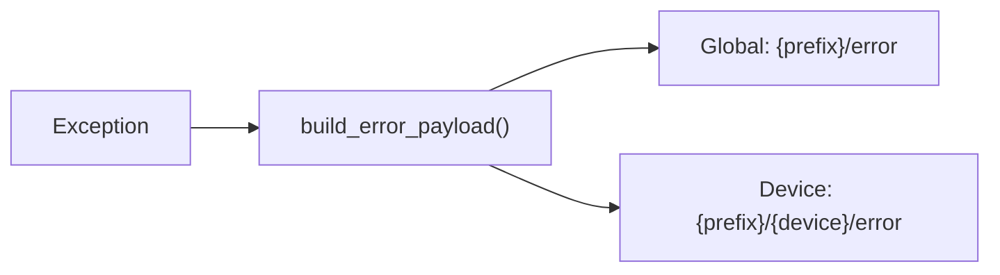

# Error Handling

Cosalette treats errors as **observable events** — structured, published to MQTT,
and designed for unattended daemons where operators cannot watch a terminal.

## Design Principles

1. **Structured payloads** — every error is a JSON object with machine-readable fields
2. **Fire-and-forget** — publication failures never crash the daemon
3. **Dual output** — errors are both logged (WARNING) and published to MQTT
4. **Error isolation** — one device crashing does not affect others
5. **Not retained** — errors are events, not state

## ErrorPayload

Every error is represented as a frozen dataclass before serialisation:

```python
@dataclass(frozen=True, slots=True)
class ErrorPayload:
    error_type: str            # (1)!
    message: str               # (2)!
    device: str | None         # (3)!
    timestamp: str             # (4)!
    details: dict[str, object] # (5)!
```

1. Machine-readable type string (e.g. `"invalid_command"`, `"timeout"`, `"error"`).
2. Human-readable error description from `str(exception)`.
3. Device name when the error is device-scoped, `None` for global errors.
4. Wall-clock ISO 8601 timestamp: `"2026-02-14T12:34:56+00:00"`.
5. Optional dict of additional context (default: empty).

### Example Payload

```json
{
    "error_type": "invalid_command",
    "message": "Position must be 0-100, got 150",
    "device": "blind",
    "timestamp": "2026-02-14T12:34:56+00:00",
    "details": {"raw_payload": "150"}
}
```

## Topic Layout

Errors are published to two topics simultaneously:



| Topic                      | Published when       | Retained |
|----------------------------|----------------------|----------|
| `{prefix}/error`           | Always               | No       |
| `{prefix}/{device}/error`  | When device is known | No       |

The global topic receives every error, making it the single subscription
point for fleet-wide monitoring (`+/error`). The per-device topic enables
targeted monitoring and Home Assistant integration.

!!! tip "Why not retained?"
    Retained errors would persist after recovery, misleading operators into
    thinking the error is ongoing. Errors are ephemeral events — they are
    delivered to current MQTT subscribers only. See [MQTT Topics](mqtt-topics.md)
    for the full retained/non-retained rationale.

## Building Error Payloads

The `build_error_payload()` function converts an exception into a structured
payload:

```python
from cosalette._errors import build_error_payload

error_type_map: dict[type[Exception], str] = {
    InvalidCommandError: "invalid_command",
    TimeoutError: "timeout",
    ConnectionError: "connection_lost",
}

payload = build_error_payload(
    error,
    error_type_map=error_type_map,
    device="blind",
    details={"raw_payload": raw},
)
```

### Error Type Mapping

The `error_type_map` is a `dict[type[Exception], str]` that maps exception
classes to machine-readable type strings:

- **Exact match only** — subclasses are *not* matched (this is intentional;
  it forces explicit registration of each error type)
- **Fallback** — unmapped exceptions receive the generic type `"error"`
- **Pluggable** — each application provides its own mapping

```python
# Framework looks up the exact class
error_type = error_type_map.get(type(error), "error")
```

## ErrorPublisher Service

The `ErrorPublisher` wraps `build_error_payload()` with fire-and-forget MQTT
publication:

```python
@dataclass
class ErrorPublisher:
    mqtt: MqttPort
    topic_prefix: str
    error_type_map: dict[type[Exception], str] = field(default_factory=dict)
    clock: Callable[[], datetime] | None = field(default=None)

    async def publish(self, error: Exception, *, device: str | None = None) -> None:
        ...
```

The entire pipeline — build → serialise → publish — is wrapped in
fire-and-forget semantics:

```python
async def publish(self, error, *, device=None):
    try:
        payload = build_error_payload(error, ...)
        payload_json = payload.to_json()
    except Exception:
        logger.exception("Failed to build error payload")
        return  # (1)!

    logger.warning("Publishing error: %s", payload.message)
    await self._safe_publish(global_topic, payload_json)
    if device is not None:
        await self._safe_publish(device_topic, payload_json)
```

1. Even if payload *construction* fails (unexpected), the daemon continues.
   This is the "fire-and-forget" guarantee — error reporting must never
   become a source of errors itself.

## Fire-and-Forget Semantics

Every MQTT publication in the error pipeline is wrapped in a `_safe_publish`
method:

```python
async def _safe_publish(self, topic: str, payload: str) -> None:
    try:
        await self.mqtt.publish(topic, payload, retain=False, qos=1)
    except Exception:
        logger.exception("Failed to publish error to %s", topic)
```

This means:

- A broker outage does not crash device tasks
- A serialisation bug does not propagate to callers
- The worst case is a lost error event (logged locally)

## Error Isolation Per Device

Each device task is wrapped in error isolation by the framework:

```python
async def _run_device(self, reg, ctx, error_publisher):
    try:
        await reg.func(ctx)
    except asyncio.CancelledError:
        raise  # (1)!
    except Exception as exc:
        logger.error("Device '%s' crashed: %s", reg.name, exc)
        await error_publisher.publish(exc, device=reg.name)
```

1. `CancelledError` propagates normally — it is the mechanism for graceful
   shutdown, not an application error.

For telemetry devices, isolation is per *polling cycle* — a single failed
reading does not stop the polling loop:

```python
async def _run_telemetry(self, reg, ctx, error_publisher, health_reporter):
    last_error_type = None
    while not ctx.shutdown_requested:
        try:
            result = await reg.func(ctx)
            await ctx.publish_state(result)
            if last_error_type is not None:
                logger.info("Telemetry '%s' recovered", reg.name)
                last_error_type = None
                health_reporter.set_device_status(reg.name, "ok")
        except asyncio.CancelledError:
            raise
        except Exception as exc:
            if type(exc) is not last_error_type:
                await error_publisher.publish(exc, device=reg.name)
            last_error_type = type(exc)
            health_reporter.set_device_status(reg.name, "error")
        await ctx.sleep(reg.interval)
```

The telemetry loop uses **state-transition deduplication**: only the first
error of each type is published to MQTT. If the same exception type recurs
on subsequent cycles, the publish is suppressed — preventing error floods
from a persistently broken sensor. When the device recovers (a successful
poll after a failure), recovery is logged at INFO level and the device
health status is restored to `"ok"` in the heartbeat payload.

---

## See Also

- [MQTT Topics](mqtt-topics.md) — topic layout and retained/non-retained rationale
- [Health & Availability](health-reporting.md) — complementary health reporting
- [Device Archetypes](device-archetypes.md) — error isolation per device type
- [Logging](logging.md) — errors are also logged at ERROR level
- [ADR-011 — Error Handling and Publishing](../adr/ADR-011-error-handling-and-publishing.md)
