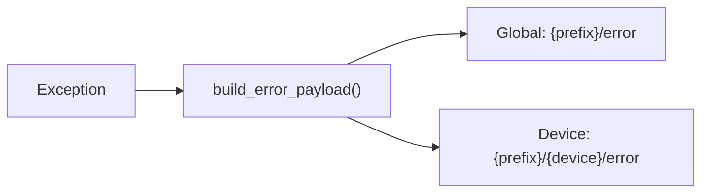

# Error Handling

Cosalette treats errors as **observable events** — structured, published to MQTT,
and designed for unattended daemons where operators cannot watch a terminal.

## Design Principles

1. **Structured payloads** — every error is a JSON object with machine-readable fields
2. **Fire-and-forget** — publication failures never crash the daemon
3. **Dual output** — errors are both logged (WARNING) and published to MQTT
4. **Error isolation** — one device crashing does not affect others, and a
   dead task is reported and restarted by the task supervisor
5. **Not retained** — errors are events, not state

## ErrorPayload

Every error is represented as a frozen dataclass before serialisation:

```python
@dataclass(frozen=True, slots=True)
class ErrorPayload:
    error_type: str  # (1)!
    message: str  # (2)!
    device: str | None  # (3)!
    timestamp: str  # (4)!
    details: dict[str, object]  # (5)!
```

1. Machine-readable type string (e.g. `"invalid_command"`, `"timeout"`, `"error"`).
2. Human-readable error description from `str(exception)`.
3. Device name when the error is device-scoped, `None` for global errors.
4. Wall-clock ISO 8601 timestamp: `"2026-02-14T12:34:56+00:00"`.
5. Optional dict of additional context (default: empty).

### Example Payload

```json
{
    "error_type": "invalid_command",
    "message": "Position must be 0-100, got 150",
    "device": "blind",
    "timestamp": "2026-02-14T12:34:56+00:00",
    "details": {"raw_payload": "150"}
}
```

## Topic Layout

Errors are published to two topics simultaneously:


```mermaid
graph LR
    E[Exception] --> B["build_error_payload()"]
    B --> G["Global: {prefix}/error"]
    B --> D["Device: {prefix}/{device}/error"]
```

| Topic                      | Published when       | Retained |
|----------------------------|----------------------|----------|
| `{prefix}/error`           | Always               | No       |
| `{prefix}/{device}/error`  | When device is known | No       |

The global topic receives every error, making it the single subscription
point for fleet-wide monitoring (`+/error`). The per-device topic enables
targeted monitoring and Home Assistant integration.

!!! tip "Why not retained?"
    Retained errors would persist after recovery, misleading operators into
    thinking the error is ongoing. Errors are ephemeral events — they are
    delivered to current MQTT subscribers only. See [MQTT Topics](mqtt-topics.md)
    for the full retained/non-retained rationale.

## Building Error Payloads

The `build_error_payload()` function converts an exception into a structured
payload:

```python
from cosalette._errors import build_error_payload

error_type_map: dict[type[Exception], str] = {
    InvalidCommandError: "invalid_command",
    TimeoutError: "timeout",
    ConnectionError: "connection_lost",
}

payload = build_error_payload(
    error,
    error_type_map=error_type_map,
    device="blind",
    details={"raw_payload": raw},
)
```

### Error Type Mapping

The `error_type_map` is a `dict[type[Exception], str]` that maps exception
classes to machine-readable type strings:

- **Exact match only** — subclasses are *not* matched (this is intentional;
  it forces explicit registration of each error type)
- **Fallback** — unmapped exceptions receive the generic type `"error"`
- **Pluggable** — each application provides its own mapping

```python
# Framework looks up the exact class
error_type = error_type_map.get(type(error), "error")
```

## Message Disclosure

`error_type` labeling and **whether the raw `str(error)` is published** are two
separate decisions. Because error topics are broker-visible, an unredacted
exception message can leak secrets — credentials embedded in a URL, a filesystem
path, a hostname. `build_error_payload()` resolves disclosure in this order:

1. **`verbose=True`** (`MqttSettings.error_publish_verbose` /
   `App(error_publish_verbose=...)`) — always discloses every exception's
   message, regardless of the other two settings. The blunt, process-wide
   escape hatch.
2. **`disclose_messages_for`** (a `frozenset[type[Exception]] | None`) — when
   not `None`, it **fully and independently** defines disclosure: a type's
   message is published only if that exact type is a member of the set.
   `error_type_map` membership is irrelevant once this is provided —
   framework-mapped types are not implicitly added to it.
3. **`error_type_map` (legacy default, `disclose_messages_for=None`)** —
   membership in `error_type_map` alone implies disclosure. This is the
   original ADR-011 LEAK-01 behaviour, preserved for backward compatibility.

```python
# Legacy conflated behaviour (disclose_messages_for=None, the default):
# labeling an exception type also discloses its message.
app = cosalette.App(
    name="caldates2mqtt",
    error_type_map={CalDavConnectionError: "caldav_connection_error"},
)

# F-DP1 decoupled opt-in: label without disclosing.
app = cosalette.App(
    name="caldates2mqtt",
    error_type_map={CalDavConnectionError: "caldav_connection_error"},
    disclose_messages_for=frozenset(),  # explicit: disclose nothing
)
```

Unlisted (or, under the legacy default, unmapped) exception types always fall
back to publishing the class name only — the full message and traceback are
still logged locally under a correlation id. See
[ADR-061](../adr/ADR-061-decoupled-error-message-disclosure.md) for the full
rationale and the planned default flip, targeted for the next 0.x minor
release (0.7.0) per ADR-061.

## ErrorPublisher Service

The `ErrorPublisher` wraps `build_error_payload()` with fire-and-forget MQTT
publication:

```python
@dataclass
class ErrorPublisher:
    mqtt: MqttPort
    topic_prefix: str
    error_type_map: dict[type[Exception], str] = field(default_factory=dict)
    clock: Callable[[], datetime] | None = field(default=None)
    verbose: bool = False
    disclose_messages_for: frozenset[type[Exception]] | None = None

    async def publish(self, error: Exception, *, device: str | None = None) -> None: ...
```

The entire pipeline — build → serialise → publish — is wrapped in
fire-and-forget semantics:

```python
async def publish(self, error, *, device=None):
    try:
        payload = build_error_payload(error, ...)
        payload_json = payload.to_json()
    except Exception:
        logger.exception("Failed to build error payload")
        return  # (1)!

    logger.warning("Publishing error: %s", payload.message)
    await self._safe_publish(global_topic, payload_json)
    if device is not None:
        await self._safe_publish(device_topic, payload_json)
```

1. Even if payload *construction* fails (unexpected), the daemon continues.
   This is the "fire-and-forget" guarantee — error reporting must never
   become a source of errors itself.

## Fire-and-Forget Semantics

Every MQTT publication in the error pipeline is wrapped in a `_safe_publish`
method:

```python
async def _safe_publish(self, topic: str, payload: str) -> None:
    try:
        await self.mqtt.publish(topic, payload, retain=False, qos=1)
    except Exception:
        logger.exception("Failed to publish error to %s", topic)
```

This means:

- A broker outage does not crash device tasks
- A serialisation bug does not propagate to callers
- The worst case is a lost error event (logged locally)

## Task Supervision

Every task the framework starts — `@app.device` generators, telemetry
entities and coalescing groups, periodic handlers and stream handlers — runs
under a **task supervisor** ([ADR-081](../adr/ADR-081-supervision-of-framework-started-tasks-with-an-on-task-failure-policy.md)).
One device crashing does not take the others down, and a dead task is never
silent.

A task counts as **failed** when it ends with an exception, or when something
outside the framework cancels it. A normal return is not a failure, and
neither is the cancellation the framework itself issues during shutdown or an
[adapter restart](health-reporting.md#auto-restart).

When a task fails, the supervisor:

1. Logs **one** `CRITICAL` line with the traceback, from the logger
   `cosalette._supervisor`:
   `Task 'device:blind' died (entities: blind): Connection refused`.
2. Publishes **one** error payload (see below).
3. Marks the task's entities offline with the availability source
   `"supervisor"`, and sets their heartbeat status to `"error"`.
   A stream is the exception: see [Stream failures](#stream-failures).
4. Applies the app's `on_task_failure` policy.

### The `on_task_failure` policy

```python
app = cosalette.App(
    name="velux2mqtt",
    version="1.0.0",
    on_task_failure="restart",  # (1)!
    task_max_restarts=3,  # (2)!
    task_restart_window=300.0,  # (3)!
)
```

1. `"restart"` (default), `"exit"` or `"ignore"`.
2. Restarts allowed per registration (per group for a coalescing group, per
   member for a group member's `init=`).
   `0` makes `"restart"` exit on the first failure.
3. Seconds without a failure after which the restart count resets to 0.

| Policy | Behaviour |
|--------|-----------|
| `"restart"` | Re-creates the task after a backoff of 1 s, doubling to a 60 s cap. Once a registration has used `task_max_restarts` restarts within the window, the app shuts down and exits with code `4`. |
| `"exit"` | Shuts the app down on the first failure; the CLI exits with code `4`. |
| `"ignore"` | Leaves the entities offline with status `"error"`; the app keeps running. |

A shutdown triggered by the supervisor raises `cosalette.TaskSupervisionError`
from `App.run()` (attributes `task_name`, `restart_count`, `internal`; the
original exception is its `__cause__`). The CLI maps it to
`EXIT_TASK_FAILURE` (`4`), so a container orchestrator with a restart policy
restarts the whole process.

!!! warning "Framework loops always exit"
    The framework's own loops (for example the heartbeat loop) are supervised
    too. If one of them dies, the app exits with code `4` under **every**
    policy, `"ignore"` included — a daemon without its heartbeat or MQTT loop
    is broken in a way a restart of one task cannot fix.

A re-created telemetry task or coalescing group waits one full interval
before its first poll, so a crash on start-up cannot turn into a tight poll
loop. When a re-created task recovers — a device reaches its first `yield`,
a telemetry task completes a cycle — the supervisor clears its mark and the
entity is online again.

### Coalescing-group member `init=` failures

A coalescing group runs as one task, but a member whose `init=` raises does
not fail it. One flaky sensor out of range at start-up must not take its
healthy group mates offline, nor crash-loop the whole app. The failure is
isolated to the member:

- the other members keep polling on their schedule;
- the supervisor logs one `CRITICAL` line,
  `Init of group member 'radon' (task 'group:airthings') failed: ...`,
  publishes one task-failure payload whose `details` carry
  `"task": "group:airthings"`, `"member": "radon"` and `"phase": "init"`,
  and marks only that member offline (source `"supervisor"`, status
  `"error"`);
- the member's triggers wait until it joins the schedule.

The app's `on_task_failure` policy applies to the member on its own:

| Policy | Member behaviour |
|--------|------------------|
| `"restart"` | The group retries the member's `init=` in place after 1 s, doubling to a 60 s cap. The member has its own budget of `task_max_restarts` within `task_restart_window`. A successful retry joins the member to the schedule at once, and it is online again after its first successful cycle. Once the budget is spent, one `CRITICAL` line is logged and the member **stays offline until the process restarts** — the app does not exit. |
| `"exit"` | The app exits with code `4`; `TaskSupervisionError.task_name` is the member key, `group:<name>/<member>`. |
| `"ignore"` | The member stays offline; its `init=` is not retried. |

If every member of a group ends up offline with no retry pending, the group
logs one `ERROR` line and idles until shutdown; it neither exits nor
restarts. A member's budget survives a re-created group — whether the
supervisor or an [adapter restart](health-reporting.md#auto-restart)
re-created it — so re-creation never resets it.

Any other failure of a group task, such as an exception raised outside a
member's `init=`, still fails the whole group as described above. An
ungrouped telemetry entity whose `init=` raises fails its own task as usual.

### Stream failures

A stream is not a device: it is not in Home Assistant discovery or the
AsyncAPI document, and it has no availability topic. A crashed stream is
reported through the log, the error payload and the heartbeat only:

- the same `CRITICAL` line and the same task-failure payload as any task;
- status `"error"` under the stream's name in the `{prefix}/status`
  heartbeat, back to `"ok"` once the re-created stream handles its first
  item;
- the same `on_task_failure` policy, restart budget and exit code `4`.

The supervisor never publishes `{prefix}/{stream}/availability`, nor
`{prefix}/availability` for a root stream. If Home Assistant entities depend
on a stream's data, let those entities report their own availability: a
telemetry entity with
[`stale_after=`](../guides/transport-availability.md#freshness-stale_after)
goes offline when no fresh data arrives.

### The task-failure error payload

The supervisor publishes the payload through the regular
[`ErrorPublisher`](#errorpublisher-service), so `error_type_map` and the disclosure
policy apply as usual. `details` identifies it as a task failure:

```json title="velux2mqtt/blind/error"
{
    "error_type": "error",
    "message": "ConnectionRefusedError",
    "device": "blind",
    "timestamp": "2026-02-14T12:34:57+00:00",
    "details": {"task_failure": true, "task": "device:blind"}
}
```

Every payload goes to the global `{prefix}/error` topic. A task that serves
one entity also publishes to that entity's error topic. A coalescing group
publishes to the global topic only, with `details.entities` listing its
members; a periodic task, which has no entity, publishes to the global topic
without a `device`. A root entity, such as a root stream registered without a
name, publishes to the global topic only; its `device` field carries the
handler name.

## Per-Cycle Isolation in Telemetry

For telemetry devices, isolation is per *polling cycle* — a single failed
reading does not stop the polling loop:

```python
# Simplified TelemetryRunner.run_telemetry (see _telemetry_runner.py)
async def run_telemetry(self, reg, ctx, error_publisher, health_reporter):
    last_error_type = None
    while not ctx.shutdown_requested:
        try:
            result = await reg.func(ctx)
            await ctx.publish_state(result)
            if last_error_type is not None:
                logger.info("Telemetry '%s' recovered", reg.name)
                last_error_type = None
                health_reporter.set_device_status(reg.name, "ok")
        except asyncio.CancelledError:
            raise
        except Exception as exc:
            if type(exc) is not last_error_type:
                await error_publisher.publish(exc, device=reg.name)
            last_error_type = type(exc)
            health_reporter.set_device_status(reg.name, "error")
        await ctx.sleep(reg.interval)
```

The telemetry loop uses **state-transition deduplication**: only the first
error of each type is published to MQTT. If the same exception type recurs
on subsequent cycles, the publish is suppressed — preventing error floods
from a persistently broken sensor. When the device recovers (a successful
poll after a failure), recovery is logged at INFO level and the device
health status is restored to `"ok"` in the heartbeat payload.

A suppressed error is not forgotten (ADR-082). While the same error persists,
the 2nd, 4th, 8th, ... failure within the first `error_reminder_interval`
(default one hour), and then one failure per interval, is logged at WARNING
and republished as a reminder. Every telemetry error payload carries the
failure streak in `details`:

```json
"details": {"count": 25, "first_seen": "2026-10-02T08:15:00+00:00"}
```

The recovery line states how long the outage lasted:

```text
Telemetry 'radon' still failing after 2h00m00s (25 consecutive failures): ...
Telemetry 'radon' recovered after 2h10m00s (26 failed cycles)
```

Pass `App(error_reminder_interval=None)` to keep only the onset and the
recovery line.

When `retry > 0` is configured on a telemetry handler, the framework wraps
the handler call in a retry loop **before** reaching the error publication
path shown above. Retry attempts are logged at WARNING level but are not
published to the error topic — only the final failure (after all retries are
exhausted) triggers the standard error-publish-and-deduplicate flow. The
retry counter is cumulative across poll cycles and resets on success. An
optional `CircuitBreaker` can short-circuit retries when a backend is
persistently unavailable. See the
[Retry / Backoff guide](../reference/telemetry.md#retry-and-backoff-strategies) and
[ADR-024](../adr/ADR-024-telemetry-retry-backoff.md) for details.

The retry machinery only engages when the handler *raises*. A handler that
*hangs* mid-`await` — a BLE read, a serial `.read()`, an HTTP call with no
internal timeout — never raises, so the retry and error-publication paths are
never reached. The `timeout=` parameter converts a hang into a
`TimeoutError`: because `TimeoutError` is a subclass of `OSError` (PEP 3151),
it flows through the existing retry/backoff/error pipeline with no extra
configuration. By default, every interval-based telemetry handler has an
implicit backstop equal to its resolved `interval`; pass `timeout=None` to
disable it for legitimately long-running handlers. See the
[Timeout backstop](../reference/telemetry.md#timeout-backstop) section and
[ADR-024 Decision 6](../adr/ADR-024-telemetry-retry-backoff.md) for details.

---

## See Also

- [MQTT Topics](mqtt-topics.md) — topic layout and retained/non-retained rationale
- [Health & Availability](health-reporting.md) — complementary health reporting
- [Device Archetypes](device-archetypes.md) — error isolation per device type
- [Logging](logging.md) — errors are also logged at ERROR level
- [ADR-011 — Error Handling and Publishing](../adr/ADR-011-error-handling-and-publishing.md)
- [ADR-061 — Decoupled Error-Message Disclosure](../adr/ADR-061-decoupled-error-message-disclosure.md)
- [ADR-024 — Telemetry Retry/Backoff](../adr/ADR-024-telemetry-retry-backoff.md)
- [ADR-081 — Supervision of Framework-Started Tasks](../adr/ADR-081-supervision-of-framework-started-tasks-with-an-on-task-failure-policy.md)
