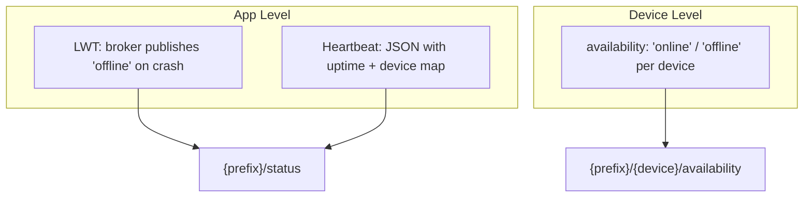
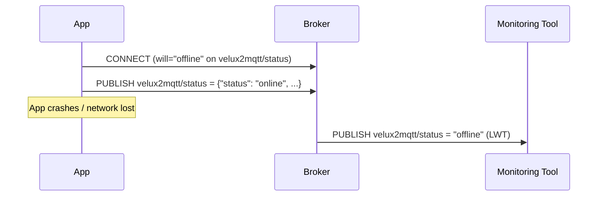

# Health & Availability

Cosalette provides **two levels of health reporting** — app-level heartbeats and
per-device availability — backed by MQTT's Last Will and Testament (LWT) for
crash detection.

## Two Levels of Health



| Level       | Topic                             | Payload        | Retained | Purpose                    |
|-------------|-----------------------------------|----------------|----------|----------------------------|
| **App**     | `{prefix}/status`                 | JSON heartbeat | Yes      | Uptime, version, fleet monitoring |
| **App LWT** | `{prefix}/status`                 | `"offline"`    | Yes      | Crash detection by broker  |
| **Device**  | `{prefix}/{device}/availability`  | `"online"` / `"offline"` | Yes | Per-device Home Assistant integration |

## Last Will and Testament (LWT)

The LWT is an MQTT feature where the client tells the broker: "If I disconnect
unexpectedly, publish *this* message on my behalf." Cosalette uses it to
guarantee that a crash results in a visible `"offline"` status.

### WillConfig

The `build_will_config()` function creates a `WillConfig` for the app's LWT:

```python
from cosalette._health import build_will_config

will = build_will_config("velux2mqtt")
# → WillConfig(
#       topic="velux2mqtt/status",
#       payload="offline",
#       qos=1,
#       retain=True,
#   )
```

This `WillConfig` is passed to `MqttClient` during construction and translated
to the broker-specific LWT format at connection time.

!!! warning "LWT is set at connection time"
    The LWT payload is registered *during* the MQTT CONNECT handshake. It
    cannot be changed after connection. This is an MQTT protocol constraint,
    not a cosalette limitation.

### Crash Detection Flow



## Structured Heartbeat

The app heartbeat is a JSON payload published to `{prefix}/status`:

```json
{
    "status": "online",
    "uptime_s": 3600.0,
    "version": "0.3.0",
    "devices": {
        "blind": {"status": "ok"},
        "temperature": {"status": "ok"}
    }
}
```

### HeartbeatPayload Fields

| Field      | Type                           | Description                          |
|------------|--------------------------------|--------------------------------------|
| `status`   | `str`                          | Always `"online"` when published     |
| `uptime_s` | `float`                        | Seconds since app start (monotonic)  |
| `version`  | `str`                          | App version string                   |
| `devices`  | `dict[str, DeviceStatus]`      | Per-device status snapshot           |

### Uptime Uses Monotonic Clock

Uptime is measured via `ClockPort` (backed by `time.monotonic()` in production):

```python
uptime = self.clock.now() - self._start_time
```

!!! info "Why monotonic for uptime?"
    `time.monotonic()` is immune to NTP adjustments and manual clock changes
    (PEP 418). If the system clock jumps backward or forward, the uptime
    value remains accurate. This is distinct from error timestamps, which use
    wall-clock time for operator correlation — see [Error Handling](error-handling.md).

### Two Payload Formats on One Topic

The `{prefix}/status` topic carries two different payload formats:

=== "LWT (string)"

    Published by the **broker** on unexpected disconnection:

    ```
    velux2mqtt/status → "offline"
    ```

=== "Heartbeat (JSON)"

    Published by the **application** while running:

    ```json
    {"status": "online", "uptime_s": 3600, "version": "0.3.0", "devices": {...}}
    ```

Consumers can distinguish them by attempting JSON parse. The LWT is always a
plain string; the heartbeat is always valid JSON.

!!! tip "Periodic heartbeat scheduling"
    Periodic heartbeats are built into the framework via the
    `heartbeat_interval` parameter on `App()`. The `HealthReporter`
    publishes heartbeat payloads automatically at the configured
    interval.

## Per-Device Availability

Each device gets its own availability topic, published automatically by the
`HealthReporter`:

| Event            | Publishes                                     | When                     |
|------------------|-----------------------------------------------|--------------------------|
| Device start     | `"online"` to `{prefix}/{device}/availability` | Phase 2 (Registration)  |
| Graceful shutdown | `"offline"` to `{prefix}/{device}/availability` | Phase 4 (Teardown)    |

```python
# Published automatically by the framework
await health_reporter.publish_device_available("blind")
# → "online" to velux2mqtt/blind/availability (retained, QoS 1)
```

This is directly compatible with Home Assistant's
[MQTT availability](https://www.home-assistant.io/integrations/mqtt/#availability)
configuration — no custom templates needed.

## HealthReporter Service

The `HealthReporter` manages all health-related publications:

```python
@dataclass
class HealthReporter:
    mqtt: MqttPort
    topic_prefix: str
    version: str
    clock: ClockPort
```

Key methods:

| Method                          | Purpose                                           |
|---------------------------------|---------------------------------------------------|
| `publish_device_available()`    | Publish `"online"` + register device in tracker    |
| `publish_device_unavailable()`  | Publish `"offline"` + remove from tracker          |
| `publish_heartbeat()`           | Publish structured JSON heartbeat                  |
| `set_device_status()`           | Update a device's status in the internal tracker   |
| `shutdown()`                    | Publish `"offline"` for all devices + app status   |

## Fire-and-Forget Publishing

All health publications are wrapped in `_safe_publish()`:

```python
async def _safe_publish(self, topic, payload, *, retain=True):
    try:
        await self.mqtt.publish(topic, payload, retain=retain, qos=1)
    except Exception:
        logger.exception("Failed to publish health to %s", topic)
```

Health reporting must never crash the application. A broker outage means
health data is temporarily lost, but service continues.

## Graceful Shutdown Sequence

During Phase 4 teardown, the `HealthReporter.shutdown()` method publishes
offline status for everything:

```python
async def shutdown(self):
    for device in list(self._devices):
        await self._safe_publish(f"{prefix}/{device}/availability", "offline")
    await self._safe_publish(f"{prefix}/status", "offline")
    self._devices.clear()
```

This ensures that a clean shutdown results in the same `"offline"` state
as a crash (via LWT). Subscribers see a consistent state regardless of
how the application stopped.

## Fleet Monitoring

Subscribe to wildcard topics to monitor multiple bridges:

```bash
# All app statuses across the fleet
mosquitto_sub -t '+/status' -v

# All device availability for one app
mosquitto_sub -t 'velux2mqtt/+/availability' -v
```

The retained nature of status and availability topics means new subscribers
immediately receive the current state of every app and device.

---

## See Also

- [MQTT Topics](mqtt-topics.md) — complete topic map and retention rules
- [Error Handling](error-handling.md) — structured error events (complementary to health)
- [Lifecycle](lifecycle.md) — when availability is published (Phases 2 and 4)
- [Hexagonal Architecture](hexagonal.md) — ClockPort for monotonic uptime
- [ADR-012 — Health and Availability Reporting](../adr/ADR-012-health-and-availability-reporting.md)
