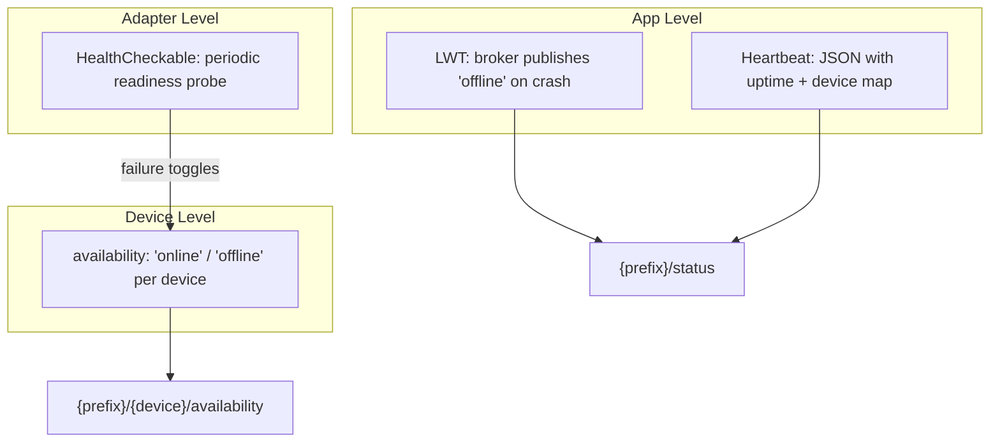
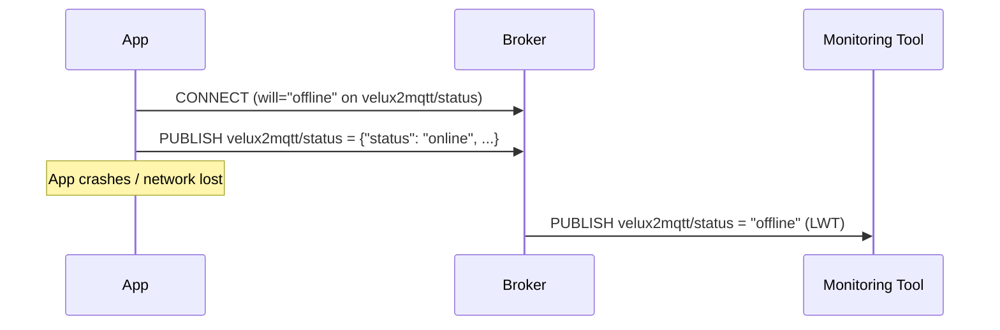
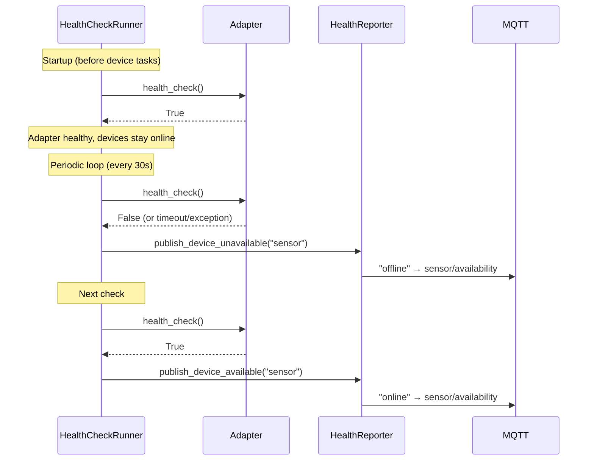
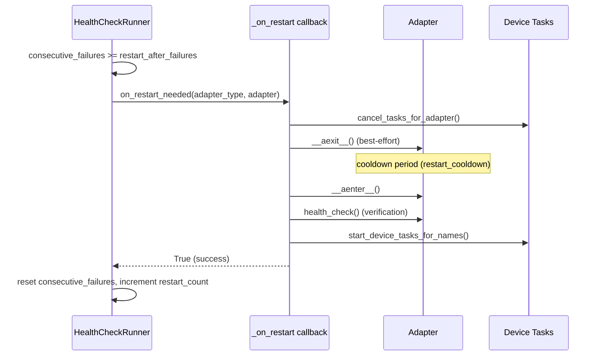

# Health & Availability

Cosalette provides **three levels of health reporting** — app-level heartbeats,
per-device availability, and adapter health checks — backed by MQTT's Last Will
and Testament (LWT) for crash detection.

## Three Levels of Health


```mermaid
graph TB
    subgraph "App Level"
        A["LWT: broker publishes 'offline' on crash"]
        B["Heartbeat: JSON with uptime + device map"]
    end
    subgraph "Device Level"
        C["availability: 'online' / 'offline' per device"]
    end
    subgraph "Adapter Level"
        E["HealthCheckable: periodic readiness probe"]
    end
    A --> S["{prefix}/status"]
    B --> S
    C --> D["{prefix}/{device}/availability"]
    E -->|"failure toggles"| C
```

| Level       | Topic                             | Payload        | Retained | Purpose                    |
|-------------|-----------------------------------|----------------|----------|----------------------------|
| **App**     | `{prefix}/status`                 | JSON heartbeat | Yes      | Uptime, version, fleet monitoring |
| **App LWT** | `{prefix}/status`                 | `"offline"`    | Yes      | Crash detection by broker  |
| **Device**  | `{prefix}/{device}/availability`  | `"online"` / `"offline"` | Yes | Per-device Home Assistant integration |
| **Adapter** | _(internal)_                      | _(toggles device availability)_ | — | Detect wedged adapters     |

## Last Will and Testament (LWT)

The LWT is an MQTT feature where the client tells the broker: "If I disconnect
unexpectedly, publish *this* message on my behalf." Cosalette uses it to
guarantee that a crash results in a visible `"offline"` status.

### WillConfig

The `build_will_config()` function creates a `WillConfig` for the app's LWT:

```python
from cosalette._health import build_will_config

will = build_will_config("velux2mqtt")
# → WillConfig(
#       topic="velux2mqtt/status",
#       payload="offline",
#       qos=1,
#       retain=True,
#   )
```

This `WillConfig` is passed to `MqttClient` during construction and translated
to the broker-specific LWT format at connection time.

!!! warning "LWT is set at connection time"
    The LWT payload is registered *during* the MQTT CONNECT handshake. It
    cannot be changed after connection. This is an MQTT protocol constraint,
    not a cosalette limitation.

### Crash Detection Flow


```mermaid
sequenceDiagram
    participant App
    participant Broker
    participant Subscriber as Monitoring Tool

    App->>Broker: CONNECT (will="offline" on velux2mqtt/status)
    App->>Broker: PUBLISH velux2mqtt/status = {"status": "online", ...}
    Note over App: App crashes / network lost
    Broker->>Subscriber: PUBLISH velux2mqtt/status = "offline" (LWT)
```

## Structured Heartbeat

The app heartbeat is a JSON payload published to `{prefix}/status`:

```json
{
    "status": "online",
    "uptime_s": 3600.0,
    "version": "0.3.0",
    "devices": {
        "blind": {"status": "ok"},
        "temperature": {"status": "error"}
    }
}
```

!!! info "Device status values"
    Device status is `"ok"` when the device is functioning normally. For
    telemetry devices, the framework automatically sets status to `"error"`
    when a polling cycle raises an exception, and restores it to `"ok"`
    when the device recovers. See [Error Handling](error-handling.md) for
    details on error deduplication.

### HeartbeatPayload Fields

| Field      | Type                           | Description                          |
|------------|--------------------------------|--------------------------------------|
| `status`   | `str`                          | Always `"online"` when published     |
| `uptime_s` | `float`                        | Seconds since app start (monotonic)  |
| `version`  | `str`                          | App version string. Omitted when `heartbeat_include_version=False`. |
| `devices`  | `dict[str, DeviceStatus]`      | Per-device status snapshot           |

!!! warning "Version disclosure"

    The `version` field lets any broker observer match your app against
    published CVEs. On shared or untrusted brokers, construct the app
    with `heartbeat_include_version=False` to omit the field entirely
    from heartbeat payloads.

### Uptime Uses Monotonic Clock

Uptime is measured via `ClockPort` (backed by `time.monotonic()` in production):

```python
uptime = self.clock.now() - self._start_time
```

!!! info "Why monotonic for uptime?"
    `time.monotonic()` is immune to NTP adjustments and manual clock changes
    (PEP 418). If the system clock jumps backward or forward, the uptime
    value remains accurate. This is distinct from error timestamps, which use
    wall-clock time for operator correlation — see [Error Handling](error-handling.md).

### Two Payload Formats on One Topic

The `{prefix}/status` topic carries two different payload formats:

=== "LWT (string)"

    Published by the **broker** on unexpected disconnection:

    ```
    velux2mqtt/status → "offline"
    ```

=== "Heartbeat (JSON)"

    Published by the **application** while running:

    ```json
    {"status": "online", "uptime_s": 3600, "version": "0.3.0", "devices": {...}}
    ```

Consumers can distinguish them by attempting JSON parse. The LWT is always a
plain string; the heartbeat is always valid JSON.

!!! tip "Periodic heartbeat scheduling"
    Periodic heartbeats are built into the framework via the
    `heartbeat_interval` parameter on `App()`. The `HealthReporter`
    publishes heartbeat payloads automatically at the configured
    interval.

## Per-Device Availability

Each device gets its own availability topic, published automatically by the
`HealthReporter`:

| Event            | Publishes                                     | When                     |
|------------------|-----------------------------------------------|--------------------------|
| Device start     | `"online"` to `{prefix}/{device}/availability` | Phase 2 (Wire)          |
| Graceful shutdown | `"offline"` to `{prefix}/{device}/availability` | Phase 4 (Teardown)    |

```python
# Published automatically by the framework
await health_reporter.publish_device_available("blind")
# → "online" to velux2mqtt/blind/availability (retained, QoS 1)
```

This is directly compatible with Home Assistant's
[MQTT availability](https://www.home-assistant.io/integrations/mqtt/#availability)
configuration — no custom templates needed.

### Sub-Entity Availability

Devices can spawn temporary sub-components with their own availability lifecycle
using `ctx.sub_entity()` (ADR-031). Entering the context manager publishes
`"online"` to `{prefix}/{device}/{sub}/availability`; exiting publishes
`"offline"` and clears retained state — mirroring the device-level pattern one
topic level deeper.

See [ADR-031 — Sub-Entity Context Manager](../adr/ADR-031-sub-entity-context-manager.md)
for the full design.

## Orphaned Retained-Topic Cleanup

When an entity is **removed from configuration** between restarts, its retained
`state` and `availability` topics would otherwise linger on the broker forever —
Home Assistant and other subscribers keep rendering a "ghost" device that no
longer exists. Apps with a configured [`store=`](persistence.md) clear these
orphaned topics automatically on the **first MQTT connect**.

The framework persists the resolved entity set under a reserved,
prefix-namespaced store key. On the next run's first connect it diffs the current
registrations against the previous run's set and publishes an empty (zero-byte)
retained message — MQTT's standard "clear retained" convention, the same one
`ctx.sub_entity()` uses on exit — to each removed entity's `state` and
`availability` topics.

| Property        | Behavior                                                          |
|-----------------|-------------------------------------------------------------------|
| **Default-on**  | Works automatically — the framework auto-resolves a store when `store=` is omitted (ADR-049) |
| **Opt-out**     | Pass `store=None` to disable persistence and skip cleanup         |
| **Once**        | Runs only on the first connect, never on reconnects               |
| **Scope**       | Clears only `state`/`availability` — never `/set`, `status`, `error`, `_meta`, or `schema` |
| **Fail-closed** | Any error is logged and swallowed; startup is never interrupted   |
| **Hardened**    | Persisted entity names are validated against the MQTT name grammar before any publish |

!!! note "Zero-config by default"
    Since ADR-049, the framework auto-resolves a `JsonFileStore` when `store=`
    is omitted, so cleanup works for every app without any store wiring.
    Only apps that explicitly pass `store=None` opt out — those must clear
    stale topics manually (`mosquitto_pub -r -n -t <topic>`). Dynamically
    created sub-entities (ADR-031) are out of scope — they clear their own
    retained state on context exit.

See [ADR-048 — Clear Orphaned Retained Topics](../adr/ADR-048-clear-orphaned-retained-topics-for-removed-entities.md)
and [ADR-049 — Default store path resolution](../adr/ADR-049-default-store-path-resolution.md)
for the full design and alternatives considered.

## HealthReporter Service

The `HealthReporter` manages all health-related publications:

```python
@dataclass
class HealthReporter:
    mqtt: MqttPort
    topic_prefix: str
    version: str
    clock: ClockPort
```

Key methods:

| Method                          | Purpose                                           |
|---------------------------------|---------------------------------------------------|
| `publish_device_available()`    | Publish `"online"` + register device in tracker    |
| `publish_device_unavailable()`  | Publish `"offline"` + remove from tracker          |
| `publish_heartbeat()`           | Publish structured JSON heartbeat                  |
| `set_device_status()`           | Update a device's status in the internal tracker   |
| `shutdown()`                    | Publish `"offline"` for all devices + app status   |

## Fire-and-Forget Publishing

All health publications are wrapped in `_safe_publish()`:

```python
async def _safe_publish(self, topic, payload, *, retain=True):
    try:
        await self.mqtt.publish(topic, payload, retain=retain, qos=1)
    except Exception:
        logger.exception("Failed to publish health to %s", topic)
```

Health reporting must never crash the application. A broker outage means
health data is temporarily lost, but service continues.

## Graceful Shutdown Sequence

During Phase 4 teardown, the `HealthReporter.shutdown()` method publishes
offline status for everything:

```python
async def shutdown(self):
    for device in list(self._devices):
        await self._safe_publish(f"{prefix}/{device}/availability", "offline")
    await self._safe_publish(f"{prefix}/status", "offline")
    self._devices.clear()
```

This ensures that a clean shutdown results in the same `"offline"` state
as a crash (via LWT). Subscribers see a consistent state regardless of
how the application stopped.

## Fleet Monitoring

Subscribe to wildcard topics to monitor multiple bridges:

```bash
# All app statuses across the fleet
mosquitto_sub -t '+/status' -v

# All device availability for one app
mosquitto_sub -t 'velux2mqtt/+/availability' -v
```

The retained nature of status and availability topics means new subscribers
immediately receive the current state of every app and device.

## Adapter Health Checks

The LWT and heartbeat mechanisms detect **crashes** — the app process dies and the
broker publishes `"offline"`. But what about adapters that are *running but broken*?
A BLE adapter can enter a wedged state (BlueZ daemon crash, hardware reset) where
connections fail indefinitely, yet the process stays alive.

Adapter health checks (ADR-028) address this gap. Adapters implement the
`HealthCheckable` protocol, and the framework probes them periodically.

### Implementing HealthCheckable

Add a single async method to any adapter:

```python
class BleAdapter:
    """BLE adapter with health check support."""

    async def connect(self) -> None: ...
    async def read(self, mac: str) -> Reading: ...

    async def health_check(self) -> bool:
        """Return True if BLE stack is responsive."""
        scanner = BleakScanner()
        await scanner.discover(timeout=5)
        return True
        # Exceptions propagate to HealthCheckRunner, which treats them as failure
```

`HealthCheckable` is a `@runtime_checkable` Protocol — the framework detects it
via `isinstance()` after adapter lifecycle entry. No registration or configuration
needed.

### How It Works


```mermaid
sequenceDiagram
    participant Runner as HealthCheckRunner
    participant Adapter
    participant Reporter as HealthReporter
    participant MQTT

    Note over Runner: Startup (before device tasks)
    Runner->>Adapter: health_check()
    Adapter-->>Runner: True
    Note over Runner: Adapter healthy, devices stay online

    Note over Runner: Periodic loop (every 30s)
    Runner->>Adapter: health_check()
    Adapter-->>Runner: False (or timeout/exception)
    Runner->>Reporter: publish_device_unavailable("sensor")
    Reporter->>MQTT: "offline" → sensor/availability

    Note over Runner: Next check
    Runner->>Adapter: health_check()
    Adapter-->>Runner: True
    Runner->>Reporter: publish_device_available("sensor")
    Reporter->>MQTT: "online" → sensor/availability
```

The lifecycle in detail:

1. **Startup check** — one probe per adapter before device tasks launch.
   Failed adapters start with their devices marked `"offline"`, but device
   tasks still start (health checks are informational, not blocking).
2. **Periodic loop** — probes every `health_check_interval` seconds
   (default 30, configurable on `App()`, `None` to disable entirely).
3. **Timeout** — each probe has a timeout of `interval / 2`. A hanging
   `health_check()` is treated as failure without blocking other adapters.
4. **Availability toggle** — on failure, all devices that depend on the
   adapter are set to `"offline"`; on recovery, they return to `"online"`.
5. **Telemetry continues** — health checks are informational. Telemetry
   polling continues even when the adapter is marked unhealthy.

### Adapter-to-Device Mapping

The framework automatically maps adapters to their dependent devices using
DI introspection. When adapter `X` fails a health check, only devices that
inject `X` via their type annotations go offline — other devices are
unaffected.

```python
app = App("myapp", health_check_interval=30.0)
app.adapter(BlePort, BleAdapter)  # implements HealthCheckable

@app.telemetry("temperature", interval=60)
async def temperature(ctx: DeviceContext, ble: BlePort) -> dict[str, object]:
    # If BleAdapter.health_check() fails, "temperature" goes offline
    return await ble.read("AA:BB:CC:DD:EE:FF")

@app.telemetry("cpu_temp", interval=60)
async def cpu_temp(ctx: DeviceContext) -> dict[str, object]:
    # No BlePort dependency — unaffected by BLE health check failures
    return {"celsius": read_cpu_temp()}
```

### Failure Counting

Each adapter's health state is tracked via `AdapterHealthStatus`:

| Field                 | Type    | Description                                        |
|-----------------------|---------|----------------------------------------------------|
| `healthy`             | `bool`  | Current health state                               |
| `consecutive_failures`| `int`   | Failures since last success (resets to 0 on recovery) |
| `last_check`          | `float` | Monotonic timestamp of last probe                  |
| `restart_count`       | `int`   | Number of restarts performed for this adapter      |
| `restart_exhausted`   | `bool`  | `True` when `restart_count` reaches `max_restarts` |
| `last_restart`        | `float` | Monotonic timestamp of last restart attempt         |
| `last_healthy_since`  | `float` | Monotonic timestamp of sustained health start      |

The `consecutive_failures` counter drives the [auto-restart](#auto-restart)
threshold — when it reaches `restart_after_failures`, a restart is triggered.

### Log Deduplication

Health check logging follows the same deduplication pattern as
[error handling](error-handling.md):

| Event              | Level   | Example                                            |
|--------------------|---------|----------------------------------------------------|
| First failure      | WARNING | `Adapter BleAdapter health check failed`           |
| Consecutive failure| DEBUG   | `Adapter BleAdapter health check failed (consecutive: 3)` |
| Recovery           | INFO    | `Adapter BleAdapter health check recovered after 3 failures` |

This prevents log flooding during sustained adapter outages while still
providing clear visibility into failure onset and recovery.

!!! tip "Complementary to crash detection"
    Health checks and LWT serve different failure modes:

    - **LWT** — the process dies (crash, OOM kill, network partition)
    - **Health checks** — the process is alive but an adapter is wedged

    Together, they provide full coverage of both infrastructure and
    hardware failures.

### Auto-Restart

When an adapter fails health checks repeatedly, the framework can automatically
restart it — exit its async context manager, wait a cooldown, re-enter, and
recreate device tasks. This handles transient hardware wedges (BLE daemon crash,
serial port reset) without operator intervention.

#### Configuration

Auto-restart is controlled by four parameters on `App()`:

| Parameter               | Default | Description                                       |
|-------------------------|---------|---------------------------------------------------|
| `restart_after_failures`| `5`     | Consecutive failures before triggering restart. `0` disables. |
| `max_restarts`          | `3`     | Maximum restarts per adapter before giving up     |
| `restart_cooldown`      | `5.0`   | Seconds to wait between exit and re-entry         |
| `sustained_health_reset`| `300.0` | Seconds of sustained health to reset restart counter |

```python
app = App(
    "myapp",
    health_check_interval=30.0,
    restart_after_failures=5,   # restart after 5 consecutive failures
    max_restarts=3,             # give up after 3 restarts
    restart_cooldown=5.0,       # 5s between exit and re-enter
    sustained_health_reset=300.0,  # 5 min healthy resets counter
)
```

#### Restart Sequence

When consecutive failures reach the threshold:


```mermaid
sequenceDiagram
    participant Runner as HealthCheckRunner
    participant Wiring as _on_restart callback
    participant Adapter
    participant Devices as Device Tasks

    Runner->>Runner: consecutive_failures >= restart_after_failures
    Runner->>Wiring: on_restart_needed(adapter_type, adapter)
    Wiring->>Devices: cancel_tasks_for_adapter()
    Wiring->>Adapter: __aexit__() (best-effort)
    Note over Adapter: cooldown period (restart_cooldown)
    Wiring->>Adapter: __aenter__()
    Wiring->>Adapter: health_check() (verification)
    Wiring->>Devices: start_device_tasks_for_names()
    Wiring-->>Runner: True (success)
    Runner->>Runner: reset consecutive_failures, increment restart_count
```

On restart failure (re-entry or post-restart health check fails), the adapter
is marked `restart_exhausted` and its devices stay offline permanently.

#### Opting Out

By default, all adapters with `HealthCheckable` + lifecycle (`__aenter__`/`__aexit__`)
are eligible for auto-restart. Set `restartable = False` on the adapter class to
opt out:

```python
class CriticalAdapter:
    """Adapter that must not be restarted mid-session."""
    restartable = False

    async def __aenter__(self) -> Self: ...
    async def __aexit__(self, *exc: object) -> None: ...
    async def health_check(self) -> bool: ...
```

#### Sustained Health Reset

If an adapter stays healthy for `sustained_health_reset` seconds (default 5 min),
its `restart_count` resets to zero. This allows adapters that experience rare
transient failures to get a fresh restart budget without accumulating toward
`max_restarts`.

---

## See Also

- [MQTT Topics](mqtt-topics.md) — complete topic map and retention rules
- [Error Handling](error-handling.md) — structured error events (complementary to health)
- [Lifecycle](lifecycle.md) — when availability is published (Phases 2 and 4)
- [Hexagonal Architecture](hexagonal.md) — ClockPort for monotonic uptime
- [ADR-012 — Health and Availability Reporting](../adr/ADR-012-health-and-availability-reporting.md)
- [ADR-028 — Adapter Health Check Protocol](../adr/ADR-028-adapter-health-check-protocol.md)
- [ADR-029 — Adapter Auto-Restart Strategy](../adr/ADR-029-adapter-auto-restart-strategy.md)
- [ADR-031 — Sub-Entity Context Manager](../adr/ADR-031-sub-entity-context-manager.md)
