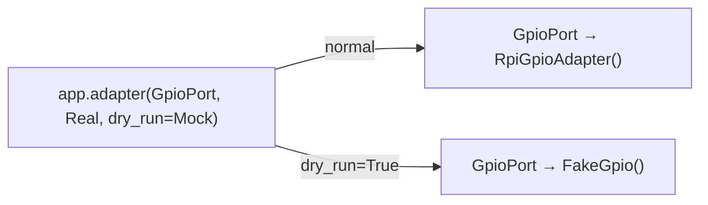
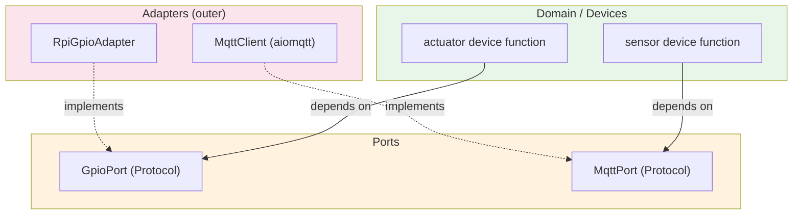

# Hexagonal Architecture

Cosalette uses **hexagonal architecture** (ports and adapters) to decouple device
logic from infrastructure concerns. Protocols define contracts; adapters provide
implementations; the framework wires them together at startup.

## Ports Are Protocols

Every port in cosalette is a PEP 544 `Protocol` with `@runtime_checkable`:

```python
from typing import Protocol, runtime_checkable

@runtime_checkable
class ClockPort(Protocol):
    """Monotonic clock for timing measurements."""

    def now(self) -> float: ...  # (1)!
```

1. Structural subtyping — any class with a `now() -> float` method satisfies
   this port. No inheritance required (PEP 544).

!!! info "Why `@runtime_checkable`?"
    The decorator enables `isinstance()` checks at runtime, which the framework
    uses to detect optional capabilities (e.g. whether an MQTT adapter supports
    `MqttLifecycle`). Without it, Protocols can only be checked statically by
    type checkers like mypy or Pyright.

## MQTT Protocol Segregation

The MQTT subsystem demonstrates **Interface Segregation** with three narrow protocols
instead of one wide interface:

```python
@runtime_checkable
class MqttPort(Protocol):
    """Publish/subscribe — the core MQTT contract."""
    async def publish(self, topic: str, payload: str, *,
                      retain: bool = False, qos: int = 1) -> None: ...
    async def subscribe(self, topic: str) -> None: ...

@runtime_checkable
class MqttLifecycle(Protocol):
    """Connection management — start/stop."""
    async def start(self) -> None: ...
    async def stop(self) -> None: ...

@runtime_checkable
class MqttMessageHandler(Protocol):
    """Inbound message dispatch registration."""
    def on_message(self, callback: MessageCallback) -> None: ...
```

Not every adapter implements all three. The `NullMqttClient` only satisfies
`MqttPort` — it has no lifecycle or message handling. The framework uses
`isinstance` to detect which capabilities are available:

```python
if isinstance(mqtt, MqttLifecycle):
    await mqtt.start()  # only called if the adapter supports it

if isinstance(mqtt, MqttMessageHandler):
    mqtt.on_message(router.route)  # only wired if supported
```

## Adapter Registration

Adapters are registered on the `App` via `app.adapter()` with three supported
forms:

=== "Class"

    ```python
    app.adapter(GpioPort, RpiGpioAdapter)
    ```

    The framework calls `RpiGpioAdapter()` at startup to create an instance.

=== "Lazy import string"

    ```python
    app.adapter(GpioPort, "myapp.gpio:RpiGpioAdapter")
    ```

    The framework calls `_import_string("myapp.gpio:RpiGpioAdapter")` at
    startup, then instantiates the imported class. The module is not loaded
    until bootstrap.

=== "Factory callable"

    ```python
    app.adapter(GpioPort, lambda: RpiGpioAdapter(pin=17))
    ```

    The framework invokes the callable directly. Useful when the adapter
    needs constructor arguments. Factory callables can also declare a
    `Settings`-typed parameter to receive the parsed settings instance
    via the framework's dependency injection system — see
    [Factory Settings Injection](../guides/adapters.md#factory-settings-injection).

All three forms also accept a `dry_run=` keyword for the dry-run variant:

```python
app.adapter(
    GpioPort,
    "myapp.gpio:RpiGpioAdapter",      # production
    dry_run="myapp.mocks:FakeGpio",    # dry-run mode
)
```

### Lazy Imports Solve the Dev-Machine Problem

Hardware libraries (`RPi.GPIO`, `bleak`, `smbus2`) are typically unavailable
on development machines. Lazy import strings defer the `import` to startup
time, which means:

- The module is never imported during `pytest` collection on a dev machine.
- Dry-run mode swaps to the mock *before* the real library is ever touched.
- Type checkers still validate the string via `TYPE_CHECKING` guards.

!!! warning "Import string format"
    The string must follow `"module.path:ClassName"` format with exactly one
    colon separator. Invalid formats raise `ValueError` at startup.

## Adapter Resolution

Device and hook code resolves adapters through the context at runtime:

```python
@app.device("motor")
async def motor(ctx: cosalette.DeviceContext) -> None:
    driver = ctx.adapter(MotorPort)  # (1)!
    await driver.set_speed(100)
```

1. Generic type parameter `T` on `adapter[T](port_type: type[T]) -> T` means
   the return type is inferred as `MotorPort` — full IDE autocompletion.

If no adapter is registered for the requested port type, `LookupError` is
raised with a clear message.

## Dry-Run Mode

When `App(dry_run=True)` is set (or `--dry-run` is passed on the CLI), the
framework transparently swaps each adapter for its dry-run variant:



This enables testing the full application topology on a machine without target
hardware, while running the exact same device code.

## The Dependency Rule

Dependencies flow **inward** — outer layers depend on inner layers, never the
reverse:



| Layer        | Imports                                        |
|--------------|------------------------------------------------|
| **Domain**   | Nothing — pure business logic                  |
| **Ports**    | Domain types only (if any)                     |
| **Devices**  | Ports (Protocols) for type hints                |
| **Adapters** | External libraries (`aiomqtt`, `RPi.GPIO`, …)  |
| **Framework**| Everything — wires at runtime via `_run_async()` |

Device functions never `import aiomqtt` or `import RPi.GPIO`. They depend on
`MqttPort` or `GpioPort` — abstract contracts that the framework satisfies at
startup.

## Framework-Provided vs App-Provided Ports

Cosalette provides two built-in port types:

| Port              | Production Adapter | Test Double      |
|-------------------|--------------------|------------------|
| `MqttPort`        | `MqttClient`       | `MockMqttClient` |
| `ClockPort`       | `SystemClock`      | `FakeClock`      |

These are wired automatically by the framework — you do not need to register
them via `app.adapter()`. Application-specific ports (GPIO, BLE, databases)
are registered by the consumer.

---

## See Also

- [Architecture](architecture.md) — the composition root that wires adapters
- [Configuration](configuration.md) — settings that configure adapter behaviour
- [Testing](testing.md) — mock adapters and the `AppHarness`
- [ADR-006 — Hexagonal Architecture](../adr/ADR-006-hexagonal-architecture.md)
- [ADR-009 — Python Version and Dependencies](../adr/ADR-009-python-version-and-dependencies.md)
