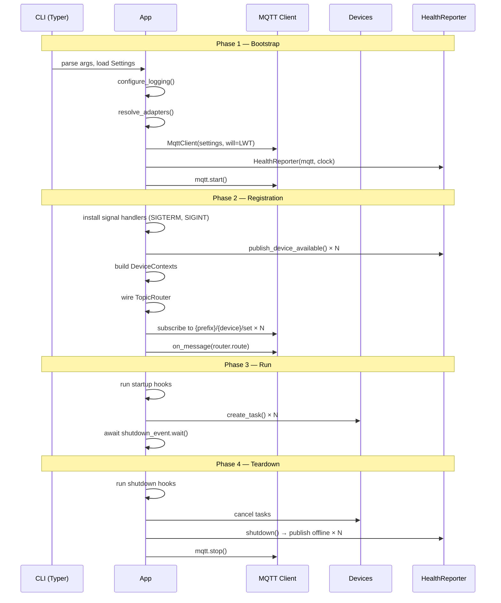

# Application Lifecycle

The cosalette lifecycle is a **four-phase orchestration** that transforms a
collection of decorated functions into a running MQTT daemon. Each phase has
clear responsibilities and well-defined boundaries.

## Phase Overview



## Phase 1 — Bootstrap

Bootstrap prepares all infrastructure before any device code runs:

1. **Settings** — `Settings` instance is created from environment variables,
   `.env` file, and CLI overrides (see [Configuration](configuration.md))
2. **Logging** — `configure_logging()` clears existing handlers, installs
   JSON or text formatter on stderr (+ optional rotating file handler)
3. **Adapters** — `_resolve_adapters()` instantiates all registered adapters,
   choosing dry-run variants when `--dry-run` is active
4. **Clock** — `SystemClock()` (or injected `FakeClock` in tests)
5. **MQTT client** — `MqttClient(settings.mqtt, will=build_will_config(prefix))`
   with the LWT pre-configured for crash detection
6. **Services** — `HealthReporter` and `ErrorPublisher` are created with
   references to the MQTT port and clock
7. **Connect** — `mqtt.start()` begins the background connection loop

```python
# Simplified bootstrap (framework internals)
resolved_settings = settings or self._settings_class()
configure_logging(resolved_settings.logging, service=self._name, version=self._version)

resolved_adapters = self._resolve_adapters()
resolved_clock = clock or SystemClock()

mqtt = self._create_mqtt(mqtt, resolved_settings)
health_reporter, error_publisher = self._create_services(mqtt, resolved_clock)

if isinstance(mqtt, MqttLifecycle):
    await mqtt.start()
```

!!! info "LWT registration"
    The Last Will and Testament is set *during* MQTT connection, not after.
    `build_will_config()` creates a `WillConfig` that the `MqttClient` passes
    to aiomqtt's `Client` constructor. If the client crashes, the broker
    publishes `"offline"` to `{prefix}/status` automatically.

## Phase 2 — Registration

Registration wires the device graph into the running infrastructure:

1. **Signal handlers** — `SIGTERM` and `SIGINT` both call `shutdown_event.set()`.
   This handles both `Ctrl+C` during development and `docker stop` in production.
2. **Device availability** — `publish_device_available()` sends `"online"` to
   `{prefix}/{device}/availability` for every registered device
3. **DeviceContexts** — one `DeviceContext` per device, pre-configured with
   the device name, MQTT port, settings, adapters, clock, and shutdown event
4. **TopicRouter** — command handler proxies are registered for each
   `@app.device` function; the router maps `{prefix}/{device}/set` to handlers
5. **Subscriptions** — MQTT subscriptions for all command topics
6. **Message wiring** — `mqtt.on_message(router.route)` connects inbound
   messages to the router

## Phase 3 — Run

The run phase is where device code executes:

1. **AppContext** — created with settings and resolved adapters
2. **Startup hooks** — `@app.on_startup` functions run sequentially, each
   receiving the `AppContext`
3. **Device tasks** — each device becomes an `asyncio.Task`:
   - `@app.device` → `_run_device()` (runs the coroutine directly)
   - `@app.telemetry` → `_run_telemetry()` (polling loop with `ctx.sleep`)
4. **Block** — `await shutdown_event.wait()` suspends the orchestrator until
   a shutdown signal arrives

```python
# Phase 3 internals
app_context = AppContext(settings=resolved_settings, adapters=resolved_adapters)
await self._run_hooks(self._startup_hooks, app_context, "Startup")

device_tasks = self._start_device_tasks(contexts, error_publisher)
await shutdown_event.wait()
```

### Hook Execution Windows

| Hook            | Runs after                | Runs before              |
|-----------------|---------------------------|--------------------------|
| `@app.on_startup` | MQTT connected + subscribed | Device tasks started   |
| `@app.on_shutdown` | Device tasks cancelled   | MQTT disconnected        |

This ordering is intentional: startup hooks can publish messages or warm
caches *before* devices begin, and shutdown hooks can flush state *after*
devices have stopped.

### Error Isolation in Hooks

Each hook is wrapped in a `try/except`:

```python
for hook in hooks:
    try:
        await hook(app_context)
    except Exception:
        logger.exception("%s hook error", label)
```

A failing startup hook does **not** prevent other hooks or devices from
running. This preserves daemon availability even when non-critical
initialization fails.

!!! warning "No rollback semantics"
    If a startup hook fails, the framework does *not* automatically call
    the corresponding shutdown hook. Hooks must be individually resilient.

## Phase 4 — Teardown

Teardown runs in reverse order to bootstrap:

1. **Shutdown hooks** — `@app.on_shutdown` functions run sequentially
2. **Cancel device tasks** — all device `asyncio.Task`s are cancelled;
   `asyncio.gather` waits for graceful completion
3. **Health offline** — `HealthReporter.shutdown()` publishes `"offline"` to
   each device's availability topic and to `{prefix}/status`
4. **MQTT disconnect** — `mqtt.stop()` cancels the connection loop

```python
# Phase 4 internals
await self._run_hooks(self._shutdown_hooks, app_context, "Shutdown")
await self._cancel_tasks(device_tasks)
await health_reporter.shutdown()

if isinstance(mqtt, MqttLifecycle):
    await mqtt.stop()
```

## Signal Handling

The framework installs handlers for both `SIGTERM` and `SIGINT`:

```python
loop = asyncio.get_running_loop()
for sig in (signal.SIGTERM, signal.SIGINT):
    loop.add_signal_handler(sig, event.set)
```

| Signal    | Source                | Effect                      |
|-----------|----------------------|------------------------------|
| `SIGINT`  | `Ctrl+C` in terminal | Sets `shutdown_event`        |
| `SIGTERM` | `docker stop`, systemd | Sets `shutdown_event`      |

Both signals trigger the same graceful shutdown path. No special handling
is needed for different deployment environments.

## Graceful Shutdown Pattern

Device code cooperates with shutdown via the `ctx.shutdown_requested` +
`ctx.sleep()` pattern:

```python
@app.device("sensor")
async def sensor(ctx: cosalette.DeviceContext) -> None:
    while not ctx.shutdown_requested:
        data = await read_sensor()
        await ctx.publish_state(data)
        await ctx.sleep(30)  # returns early on shutdown
    # cleanup code runs here
```

`ctx.sleep()` internally races an `asyncio.sleep` against the shutdown event.
When shutdown is signalled, sleep returns immediately (without raising), and
the `while` loop exits naturally.

## CLI Orchestration

The full path from command line to async lifecycle:

```
$ myapp --log-level DEBUG
    │
    ├── Typer parses CLI flags
    ├── loads Settings from env + .env
    ├── applies CLI overrides (--log-level, --log-format)
    └── asyncio.run(app._run_async(settings=...))
            │
            ├── Phase 1: Bootstrap
            ├── Phase 2: Registration
            ├── Phase 3: Run
            └── Phase 4: Teardown
```

---

## See Also

- [Architecture](architecture.md) — composition root and test seams
- [Device Archetypes](device-archetypes.md) — how devices execute in Phase 3
- [Health & Availability](health-reporting.md) — availability publishing in Phases 2 and 4
- [Error Handling](error-handling.md) — error isolation during device execution
- [ADR-001 — Framework Architecture Style](../adr/ADR-001-framework-architecture-style.md)
- [ADR-005 — CLI Framework](../adr/ADR-005-cli-framework.md)
