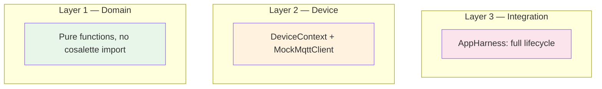

# Testing

Cosalette provides a **three-layer testing strategy** with purpose-built test
doubles and a pytest plugin — making it straightforward to test device code
without a real MQTT broker or hardware.

## Three Layers



| Layer         | What you test                | Dependencies                       | Speed   |
|---------------|------------------------------|-------------------------------------|---------|
| **Domain**    | Pure business logic          | None — no cosalette imports          | Fastest |
| **Device**    | Device functions + MQTT flow | `cosalette.testing` fixtures         | Fast    |
| **Integration** | Full app lifecycle          | `AppHarness` (all test doubles)     | Fast    |

### Sociable Over Isolated

Cosalette follows the **sociable unit test** philosophy: test collaborating
objects together rather than mocking every boundary. Device tests use real
`DeviceContext` with a `MockMqttClient` — testing the actual publish flow,
not a mock of it.

!!! info "Why sociable?"
    Isolated unit tests that mock every dependency tend to test the mocking
    framework, not the code. Sociable tests catch integration issues early
    while remaining fast because the test doubles are lightweight in-memory
    implementations.

## Test Doubles

### MockMqttClient

In-memory MQTT double that records all interactions:

```python
from cosalette.testing import MockMqttClient

mqtt = MockMqttClient()
await mqtt.publish("test/state", '{"value": 42}', retain=True, qos=1)

assert mqtt.publish_count == 1
messages = mqtt.get_messages_for("test/state")
assert messages[0] == ('{"value": 42}', True, 1)  # (payload, retain, qos)
```

Key capabilities:

| Method / Property     | Purpose                                          |
|-----------------------|--------------------------------------------------|
| `published`           | List of `(topic, payload, retain, qos)` tuples   |
| `subscriptions`       | List of subscribed topic strings                  |
| `get_messages_for()`  | Filter published messages by topic                |
| `deliver()`           | Simulate an inbound message to registered callbacks |
| `on_message()`        | Register a callback for inbound message dispatch  |
| `raise_on_publish`    | Set an exception to simulate publication failure  |
| `reset()`             | Clear all recorded data                           |
| `publish_count`       | Number of recorded publishes                      |
| `subscribe_count`     | Number of recorded subscriptions                  |

#### Simulating Inbound Commands

```python
mqtt = MockMqttClient()
mqtt.on_message(router.route)  # wire the router

# Simulate a command arriving from the broker
await mqtt.deliver("velux2mqtt/blind/set", "50")
```

#### Failure Injection

```python
mqtt = MockMqttClient()
mqtt.raise_on_publish = ConnectionError("Broker offline")

# This publish will raise — tests can verify error handling
await mqtt.publish("test/state", "{}")
```

### FakeClock

Deterministic clock for timing tests — no real time dependency:

```python
from cosalette.testing import FakeClock

clock = FakeClock()        # starts at 0.0
assert clock.now() == 0.0

clock._time = 3600.0       # advance 1 hour
assert clock.now() == 3600.0
```

The `FakeClock` satisfies `ClockPort` via structural subtyping (PEP 544).
The `HealthReporter` uses it to calculate deterministic uptime values.

### NullMqttClient

Silent no-op adapter — every method logs at DEBUG and returns without side
effects. Useful as a default when MQTT is not needed:

```python
from cosalette.testing import NullMqttClient

null = NullMqttClient()
await null.publish("topic", "payload")  # silently discarded
```

### make_settings()

Factory that creates `Settings` without `.env` files or environment variables:

```python
from cosalette.testing import make_settings

settings = make_settings()
assert settings.mqtt.host == "localhost"  # model defaults only

from cosalette._settings import MqttSettings
custom = make_settings(mqtt=MqttSettings(host="broker.test"))
assert custom.mqtt.host == "broker.test"
```

Internally, `make_settings()` uses `_IsolatedSettings` — a `Settings` subclass
that strips all configuration sources except `init_settings`:

```python
class _IsolatedSettings(Settings):
    @classmethod
    def settings_customise_sources(cls, settings_cls, init_settings, ...):
        return (init_settings,)  # ignore env, dotenv, secrets
```

This guarantees deterministic tests regardless of the host environment.

## AppHarness

The `AppHarness` is the highest-level test utility — a one-liner that wires
`App` + `MockMqttClient` + `FakeClock` + `Settings` + shutdown event:

```python
from cosalette.testing import AppHarness

harness = AppHarness.create()  # (1)!

@harness.app.device("sensor")
async def sensor(ctx):
    await ctx.publish_state({"value": 42})
    harness.trigger_shutdown()  # (2)!

await harness.run()  # (3)!

messages = harness.mqtt.get_messages_for("testapp/sensor/state")
assert len(messages) == 1
```

1. Creates fresh `App`, `MockMqttClient`, `FakeClock`, `make_settings()`, and `asyncio.Event`.
2. Signal shutdown from inside device code — the lifecycle completes gracefully.
3. Runs `_run_async()` with all test doubles injected.

### AppHarness.create() Parameters

| Parameter            | Default      | Purpose                           |
|----------------------|--------------|-----------------------------------|
| `name`               | `"testapp"`  | App name (topic prefix)           |
| `version`            | `"1.0.0"`    | App version in heartbeats         |
| `dry_run`            | `False`      | Forward to App for adapter selection |
| `**settings_overrides` | —          | Forwarded to `make_settings()`    |

## Test Seams in _run_async()

The framework's `_run_async()` method accepts four optional parameters
specifically designed as test injection points:

```python
await app._run_async(
    settings=make_settings(),        # skip env/dotenv
    shutdown_event=asyncio.Event(),  # manual shutdown
    mqtt=MockMqttClient(),           # in-memory MQTT
    clock=FakeClock(),               # deterministic time
)
```

When any parameter is `None`, the framework uses the real implementation.
This opt-in injection means production code and test code use the same
`_run_async()` method.

## Pytest Plugin

The `cosalette.testing` package includes a pytest plugin that provides
fixtures for the most common test patterns:

```python title="conftest.py"
pytest_plugins = ["cosalette.testing._plugin"]
```

### Available Fixtures

| Fixture          | Type              | Description                            |
|------------------|-------------------|----------------------------------------|
| `mock_mqtt`      | `MockMqttClient`  | Fresh MockMqttClient per test          |
| `fake_clock`     | `FakeClock`       | FakeClock starting at 0.0              |
| `device_context` | `DeviceContext`   | Pre-wired with mock_mqtt + fake_clock  |

The `device_context` fixture creates a `DeviceContext` configured with
`name="test_device"`, `topic_prefix="test"`, and test doubles:

```python
async def test_publish_state(device_context):
    await device_context.publish_state({"value": 42})
    # device_context uses mock_mqtt internally
```

!!! tip "Lazy imports in fixtures"
    The plugin uses lazy imports inside fixture bodies to avoid importing
    cosalette modules before `pytest-cov` begins coverage tracing. This is
    the same lazy-import pattern used in the [hexagonal architecture](hexagonal.md)
    for hardware libraries.

## Test Utilities Summary

| Utility            | Layer         | Purpose                                      |
|--------------------|---------------|----------------------------------------------|
| `MockMqttClient`   | Device + Integration | Records MQTT interactions, simulates inbound |
| `FakeClock`         | Device + Integration | Deterministic time for uptime/timing tests   |
| `NullMqttClient`    | Any           | Silent no-op MQTT adapter                    |
| `make_settings()`   | Device + Integration | Environment-isolated settings factory        |
| `AppHarness`        | Integration   | Full lifecycle test harness                   |
| `device_context`    | Device        | Pre-wired DeviceContext fixture               |

---

## See Also

- [Architecture](architecture.md) — test seams in the composition root
- [Hexagonal Architecture](hexagonal.md) — lazy imports and Protocol-based ports
- [Device Archetypes](device-archetypes.md) — testing device functions
- [Lifecycle](lifecycle.md) — what `AppHarness.run()` exercises
- [ADR-007 — Testing Strategy](../adr/ADR-007-testing-strategy.md)
