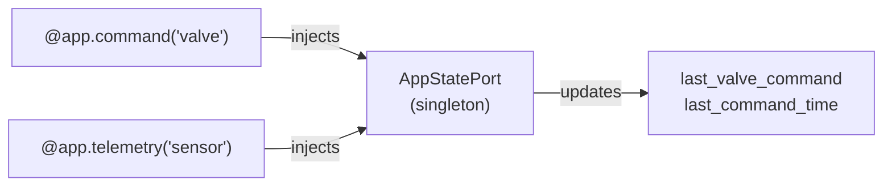

# Share State Between Handlers

In a typical cosalette application, different handlers need access to
shared mutable state. For example, a `@app.command()` handler might
update a valve position, and a `@app.telemetry()` handler needs to
report that position alongside sensor readings.

cosalette's adapter system solves this naturally — adapters are
**app-scoped singletons** that are injected into every handler
requesting the same port type.

!!! note "Prerequisites"

    This guide assumes you've read the
    [Hardware Adapters](adapters.md) guide and understand the
    ports-and-adapters pattern.

## The Pattern

The idea is straightforward:

1. Define a **port** (Protocol) for your shared state.
2. Implement a **concrete class** that holds the mutable state.
3. **Register** it as an adapter — the framework creates one instance at startup.
4. **Declare** the port type in any handler's signature — the framework injects
   the same instance everywhere.



## Step 1: Define a State Port

Unlike hardware ports, a state port doesn't wrap external hardware — it
defines an interface for application-internal state. Keep it focused on
what consumers need to _read_:

```python title="ports.py"
from typing import Protocol, runtime_checkable


@runtime_checkable
class AppStatePort(Protocol):
    """Shared application state between handlers."""

    @property
    def last_valve_command(self) -> str | None: ...

    @property
    def last_command_time(self) -> float | None: ...
```

!!! tip "Use properties on state ports"

    Exposing **read-only properties** on the port keeps the interface narrow.
    Write access happens through methods on the concrete class. This way, only
    the handler that writes to state needs to know about the implementation —
    readers depend only on the protocol.

## Step 2: Implement the State Class

The concrete implementation holds the mutable fields:

```python title="state.py"
import time


class AppState:
    """Concrete shared state — single instance per application."""

    def __init__(self) -> None:
        self._last_valve_command: str | None = None
        self._last_command_time: float | None = None

    @property
    def last_valve_command(self) -> str | None:
        return self._last_valve_command

    @property
    def last_command_time(self) -> float | None:
        return self._last_command_time

    def record_command(self, command: str) -> None:  # (1)!
        """Record a valve command with timestamp."""
        self._last_valve_command = command
        self._last_command_time = time.monotonic()
```

1. The `record_command` method is on the concrete class, not on the protocol. This
   means only the command handler (which needs the concrete type or a wider protocol)
   can mutate state. Telemetry handlers only read through the narrow port.

## Step 3: Register and Use

```python title="app.py"
import cosalette
from cosalette.testing import MockMqttClient

from ports import AppStatePort
from state import AppState

app = cosalette.App(name="mybridge", version="1.0.0")
app.adapter(AppStatePort, AppState)  # (1)!


@app.telemetry("sensor", interval=5.0)
async def read_sensor(state: AppStatePort) -> dict[str, object]:  # (2)!
    """Report sensor data alongside the last valve command."""
    return {
        "temperature": 22.5,
        "last_valve": state.last_valve_command,
    }


@app.command("valve")
async def handle_valve(  # (3)!
    payload: str, state: AppState
) -> dict[str, object]:
    """Handle valve commands and record the action."""
    state.record_command(payload)
    return {"valve_state": payload}


app.run(mqtt=MockMqttClient())
```

1. One instance of `AppState` is created at startup and shared across all handlers.
2. The telemetry handler declares `AppStatePort` (the protocol) — it only sees the
   read-only properties. The framework injects the same `AppState` instance because
   `AppState` satisfies the `AppStatePort` protocol structurally.
3. The command handler declares the concrete `AppState` type to access the
   `record_command()` method. Both annotations resolve to the same singleton — the
   framework uses `issubclass` matching.

!!! info "Protocol vs concrete type"

    Both `AppStatePort` and `AppState` resolve to the **same instance**. The
    framework's injection resolver checks:

    1. Exact type match
    2. `issubclass` match for Settings subclasses
    3. `issubclass` match for adapter port types

    Since `AppState` satisfies `AppStatePort` (structural subtyping), either
    annotation works. Using the protocol in readers and the concrete type in
    writers is a common pattern that maximises flexibility.

## When Not to Use This Pattern

This adapter-as-state pattern works well for **simple, in-memory state**. Consider
alternatives when:

| Scenario | Better approach |
|----------|----------------|
| State needs to survive restarts | Persist to disk/database in the lifespan teardown |
| State needs thread safety | Use `asyncio.Lock` inside the state class |
| Per-device scoped state (separate instance per device name) | Manages state internally with a `dict[str, ...]` keyed by device name |
| Complex dependency chains (state depends on Settings to construct) | Use a [factory callable](adapters.md) in `app.adapter()` or construct in the [lifespan](lifespan.md) |

## Complete Example

Here's a self-contained application that demonstrates the full pattern:

```python title="shared_state_example.py"
"""Shared state between handlers — complete example."""

import random
import time
from typing import Protocol, runtime_checkable

import cosalette
from cosalette.testing import MockMqttClient


# --- Port ---
@runtime_checkable
class AppStatePort(Protocol):
    """Read-only view of shared application state."""

    @property
    def last_valve_command(self) -> str | None: ...

    @property
    def last_command_time(self) -> float | None: ...


# --- Implementation ---
class AppState:
    """Mutable shared state — created once at startup."""

    def __init__(self) -> None:
        self._last_valve_command: str | None = None
        self._last_command_time: float | None = None

    @property
    def last_valve_command(self) -> str | None:
        return self._last_valve_command

    @property
    def last_command_time(self) -> float | None:
        return self._last_command_time

    def record_command(self, command: str) -> None:
        self._last_valve_command = command
        self._last_command_time = time.monotonic()


# --- App ---
app = cosalette.App(name="stateapp", version="1.0.0")
app.adapter(AppStatePort, AppState)


@app.telemetry("sensor", interval=3.0)
async def read_sensor(state: AppStatePort) -> dict[str, object]:
    """Reads sensor + reports last valve command."""
    return {
        "temperature": round(20.0 + random.uniform(-2, 2), 1),
        "last_valve": state.last_valve_command,
    }


@app.command("valve")
async def handle_valve(payload: str, state: AppState) -> dict[str, object]:
    """Receives valve commands and records them in shared state."""
    state.record_command(payload)
    return {"valve_state": payload}


app.run(mqtt=MockMqttClient())
```

---

## See Also

- [Hardware Adapters](adapters.md) — registration forms, dry-run swapping,
  factory callables
- [Hexagonal Architecture](../concepts/hexagonal.md) — conceptual foundation
  for ports and adapters
- [Build a Full App](full-app.md) — capstone guide combining all patterns
