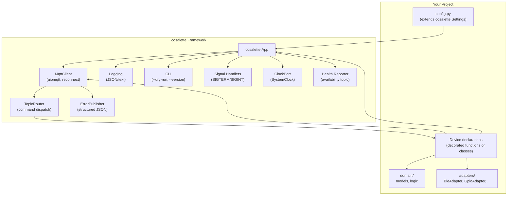

# cosalette — Framework Architecture Proposal

> **Status:** Draft for review
> **Date:** 2026-02-14
> **Context:** [Answers](answers.md)

---

## Executive Summary

**cosalette** is an opinionated Python framework for building IoT-to-MQTT bridge
applications. It provides the full lifecycle — configuration, logging, MQTT
client management, structured error reporting, graceful shutdown, CLI — so that
project authors focus exclusively on their device-specific domain logic and
hardware adapters.

Think of it as "FastAPI for MQTT daemons": you declare your devices, implement
a thin hardware adapter, and the framework runs everything else.

---

## 1. Design Principles

1. **Framework calls your code** — Inversion of Control. You register devices
   and adapters; cosalette owns the event loop, signal handlers, MQTT lifecycle, and
   logging.
2. **Convention over configuration** — Fixed MQTT topic layout, prescribed
   logging format, mandatory error topic. Less to decide per project.
3. **Hexagonal at the core** — Ports & Adapters architecture is embedded in the
   framework. Domain logic is always pure, adapters are always pluggable.
4. **Batteries included, escape hatches available** — Sensible defaults for
   everything, but hooks at each lifecycle phase for projects that need custom
   behaviour.
5. **Standalone apps** — Each project produces an independent console
   application. No shared runtime, no inter-process coupling.

---

## 2. The Two Archetypes

Analysing all 8 projects reveals two fundamental patterns:

### Archetype A: Command & Control (Bidirectional)

Subscribe to MQTT command topics, translate into device actions, publish state.

| Project | Hardware | Library |
| ------- | -------- | ------- |
| velux2mqtt | GPIO relay pulses | RPi.GPIO |
| wiz2mqtt | WiFi UDP | pywizlight |
| concept2mqtt | BLE | bleak (CSAFE) |
| wallpanel2mqtt | LAN SSH | asyncssh |
| smartmeter2mqtt | USB/IR | pyserial/FTDI |
| vito2mqtt | USB/Optolink | pyserial/vcontrold |

**Pattern:** MQTT command → parse → device action → read state → publish

### Archetype B: Telemetry (Unidirectional)

Poll or stream sensor data, publish readings to MQTT.

| Project | Hardware | Library |
| ------- | -------- | ------- |
| airthings2mqtt | BLE | airthings wave-reader/bleak |
| gas2mqtt | I²C (HMC5883) via GPIO | smbus2 |

**Pattern:** poll/stream → read → transform → publish

Many projects combine both (e.g., smartmeter2mqtt reads data continuously but
also accepts configuration commands). The framework must support both
archetypes natively, and allow them to be mixed within a single application.

---

## 3. Core Architecture

### 3.1 Layer Diagram

```text
┌─────────────────────────────────────────────────────────────┐
│                     Your Project                            │
│  ┌──────────────┐  ┌──────────────┐  ┌───────────────────┐  │
│  │ domain/      │  │ adapters/    │  │ config (extends   │  │
│  │ models,      │  │ hardware     │  │ cosalette.Settings)     │  │
│  │ logic        │  │ protocols    │  │                   │  │
│  └──────┬───────┘  └──────┬───────┘  └───────────────────┘  │
│         │                 │                                  │
├─────────┼─────────────────┼──────────────────────────────────┤
│         │       cosalette Framework                                │
│  ┌──────┴───────┐  ┌──────┴───────┐  ┌───────────────────┐  │
│  │ App          │  │ DevicePort   │  │ Settings (base)   │  │
│  │ lifecycle,   │  │ protocol     │  │ pydantic-settings  │  │
│  │ registration │  │ contracts    │  │                   │  │
│  ├──────────────┤  ├──────────────┤  ├───────────────────┤  │
│  │ MQTT Client  │  │ Error        │  │ Logging           │  │
│  │ (aiomqtt)    │  │ Publisher    │  │ JSON + text       │  │
│  ├──────────────┤  ├──────────────┤  ├───────────────────┤  │
│  │ CLI          │  │ Health       │  │ Clock, Signals    │  │
│  │ (typer)      │  │ Reporting    │  │                   │  │
│  └──────────────┘  └──────────────┘  └───────────────────┘  │
└─────────────────────────────────────────────────────────────┘
```

### 3.2 How It Fits Together



---

## 4. MQTT Topic Convention

Standardised across all cosalette projects. Follows [MQTT best practices](https://www.hivemq.com/blog/mqtt-essentials-part-5-mqtt-topics-best-practices/)
and Home Assistant discovery conventions.

### 4.1 Topic Layout

```text
{app_name}/{device_name}/state          → device state (JSON, retained)
{app_name}/{device_name}/set            → command input (subscribed)
{app_name}/{device_name}/availability   → online/offline (retained, LWT)
{app_name}/error                        → structured error events
{app_name}/status                       → app-level health (online/offline, LWT)
```

**Design decisions:**

| Choice | Rationale |
| ------ | --------- |
| `state` not `actual` | Aligns with Home Assistant MQTT convention |
| `set` for commands | Home Assistant convention, clear intent |
| `availability` per device | Allows individual device health monitoring |
| `status` at app level | Last Will & Testament for crash detection |
| Flat structure | Avoids deep nesting; each device is a first-class citizen |
| JSON payloads | Machine-parseable, extensible, universal |
| Retained state | Clients get current state on connect without polling |

### 4.2 Examples Across Projects

```text
# velux2mqtt
velux2mqtt/blind/state          {"position": 50, "moving": false}
velux2mqtt/blind/set            "50" | "UP" | "DOWN" | "STOP"
velux2mqtt/window/state         {"position": 0, "moving": false}

# wiz2mqtt
wiz2mqtt/bedroom_ceiling/state  {"power": true, "brightness": 80, "scene": "Cozy"}
wiz2mqtt/bedroom_ceiling/set    {"brightness": 50}

# airthings2mqtt  (telemetry only — no /set topic)
airthings2mqtt/wave-1/state     {"radon_bq_m3": 42, "temperature": 21.3, "humidity": 55}

# gas2mqtt  (telemetry only)
gas2mqtt/counter/state          {"count": 1234, "trigger": "CLOSED", "temperature": 20.5}
```

### 4.3 Telemetry-Only Devices

Telemetry devices simply never subscribe to a `set` topic. The framework skips
command subscription when the device has no command handler registered.

---

## 5. API Design — "FastAPI for MQTT Daemons"

### 5.1 The `App` Object

The central object. Inspired by FastAPI's `FastAPI()` — you instantiate it, then
register devices and lifecycle hooks via decorators or method calls.

```python
import cosalette

app = cosalette.App(
    name="velux2mqtt",
    version="0.1.0",
)
```

The `App` owns:

- MQTT client lifecycle (connect, reconnect, disconnect, LWT)
- Signal handling (SIGTERM, SIGINT → graceful shutdown)
- Logging configuration (JSON or text, configurable level)
- CLI (`--dry-run`, `--version`, `--log-level`, `--log-format`)
- Error publication (structured JSON to `{name}/error`)
- Health reporting (`{name}/status` with LWT)
- Device registry and lifecycle callbacks

### 5.2 Device Registration — Decorator API

#### Command & Control Device

```python
from cosalette import App, DeviceContext

app = App(name="velux2mqtt", version="0.1.0")


@app.device("blind")
async def blind(ctx: DeviceContext) -> None:
    """Device lifecycle — runs once per device at startup."""
    gpio = ctx.adapter(GpioPort)  # resolved from config

    @ctx.on_command
    async def handle(payload: str) -> None:
        command = parse_command(payload)
        await execute(command, gpio, ctx)
        await ctx.publish_state({"position": get_position(), "moving": is_moving()})

    # Publish initial state
    await ctx.publish_state({"position": None, "moving": False})
```

#### Telemetry Device

```python
from cosalette import App, DeviceContext

app = App(name="gas2mqtt", version="0.1.0")


@app.device("counter")
async def counter(ctx: DeviceContext) -> None:
    """Polling telemetry — framework manages the lifecycle."""
    bus = smbus.SMBus(1)

    while not ctx.shutdown_requested:
        bz = read_magnetometer(bus)
        if trigger_detected(bz):
            await ctx.publish_state({"count": count, "trigger": "CLOSED"})
        await ctx.sleep(1.0)  # framework-aware sleep (respects shutdown)
```

#### Periodic Telemetry (Shorthand)

```python
@app.telemetry("wave-1", interval=30.0)
async def wave_sensor(ctx: DeviceContext) -> dict:
    """Called every 30 seconds. Return value is published as state."""
    reading = await ble_client.read_characteristic(...)
    return {"radon_bq_m3": reading.radon, "temperature": reading.temp}
```

### 5.3 The `DeviceContext` Object

Injected into every device function. Provides the framework services relevant
to that specific device.

```python
class DeviceContext:
    """Per-device context injected by the framework."""

    name: str                          # device name as registered
    settings: Settings                 # app settings (your subclass)
    clock: ClockPort                   # monotonic clock (injectable for tests)
    shutdown_requested: bool           # True when SIGTERM/SIGINT received

    async def publish_state(self, payload: dict, *, retain: bool = True) -> None:
        """Publish to {app}/{device}/state as JSON."""
        ...

    async def publish(self, channel: str, payload: str, **kwargs) -> None:
        """Publish to {app}/{device}/{channel} — escape hatch."""
        ...

    async def sleep(self, seconds: float) -> None:
        """Shutdown-aware sleep. Returns early if shutdown_requested."""
        ...

    def on_command(self, handler: Callable) -> None:
        """Register a command handler for this device's /set topic."""
        ...

    def adapter(self, port_type: type[T]) -> T:
        """Resolve an adapter from the app's adapter registry."""
        ...
```

### 5.4 Lifecycle Hooks

```python
@app.on_startup
async def startup(ctx: AppContext) -> None:
    """Called after MQTT is connected, before devices start."""
    logger.info("Custom startup logic here")


@app.on_shutdown
async def shutdown(ctx: AppContext) -> None:
    """Called after devices stop, before MQTT disconnects."""
    await cleanup_resources()
```

### 5.5 Adapter Registration

Hardware adapters are registered with the app and resolved by port type.
This keeps the hexagonal pattern: devices depend on port protocols, not
concrete adapters.

```python
from cosalette import App
from velux2mqtt.adapters import RpiGpioAdapter, DryRunGpioAdapter
from velux2mqtt.ports import GpioPort

app = App(name="velux2mqtt", version="0.1.0")

# Register adapters — resolved by port type in device functions
app.adapter(GpioPort, RpiGpioAdapter, dry_run=DryRunGpioAdapter)
```

In `--dry-run` mode, the framework automatically swaps the dry-run variant.

### 5.6 Configuration

Projects extend `cosalette.Settings` with their own fields. The framework base
provides MQTT, logging, and CLI settings.

```python
import cosalette


class VeluxSettings(cosalette.Settings):
    """velux2mqtt-specific settings."""

    gpio_mode: Literal["BCM", "BOARD"] = "BCM"
    actuators: list[ActuatorConfig] = []

    class Config:
        env_prefix = "VELUX2MQTT_"  # or "" for clean docker env files
```

**Framework `cosalette.Settings` provides:**

```python
class Settings(BaseSettings):
    """Base settings — all cosalette apps inherit these."""

    mqtt: MqttSettings = MqttSettings()
    logging: LoggingSettings = LoggingSettings()

    model_config = SettingsConfigDict(
        env_nested_delimiter="__",
        env_file=".env",
        env_file_encoding="utf-8",
    )
```

The `env_prefix` is configurable per project — defaults to `""` but can be
set to `"VELUX2MQTT_"`, `"GAS2MQTT_"`, etc.

### 5.7 Entry Point

```python
# velux2mqtt/main.py
from velux2mqtt.app import app

if __name__ == "__main__":
    app.run()
```

Or via `pyproject.toml`:

```toml
[project.scripts]
velux2mqtt = "velux2mqtt.app:app.run"
```

`app.run()` does everything:

1. Parse CLI arguments (`--dry-run`, `--version`, `--log-level`, `--log-format`)
2. Load and validate configuration
3. Configure logging
4. Connect to MQTT broker (with LWT for `{name}/status`)
5. Start all registered devices (as concurrent tasks)
6. Run startup hooks
7. Block until shutdown signal
8. Stop devices, run shutdown hooks, disconnect MQTT

---

## 6. Answering: "Is Hexagonal Compatible with FastAPI-style?"

**Yes, and this design proves it.** Here's how they map:

| Hexagonal Concept | cosalette Equivalent |
| ----------------- | -------------- |
| **Domain layer** | Your `domain/` package — pure logic, no cosalette imports |
| **Port protocols** | Your `ports/` — `Protocol` classes (PEP 544) |
| **Adapters** | Registered via `app.adapter()`, resolved via `ctx.adapter()` |
| **Application layer** | Your device functions — orchestrate domain + ports |
| **Composition root** | `app.run()` — the framework IS the composition root |
| **Infrastructure** | cosalette provides MQTT, logging, clock; you provide hardware adapters |

The key insight: **the framework replaces `main.py` (composition root)**. Your
code never imports from infrastructure directly — it declares ports and
implements adapters. The framework wires them together, just like FastAPI
wires routes to an ASGI server.

The dependency rule is preserved:

```text
domain/  →  imports nothing (pure Python)
ports/   →  imports domain types only
devices  →  import domain + ports (NOT adapters directly)
adapters →  import ports + external libraries
cosalette      →  wires adapters to ports at runtime
```

---

## 7. What cosalette Provides vs. What You Write

### Framework (cosalette package)

| Component | Description |
| --------- | ----------- |
| `cosalette.App` | Application object — lifecycle, device registry, hooks |
| `cosalette.DeviceContext` | Per-device context — state publishing, commands, sleep |
| `cosalette.Settings` | Base pydantic-settings with MQTT + logging |
| `cosalette.MqttClient` | aiomqtt wrapper with reconnection, LWT, callbacks |
| `cosalette.ErrorPublisher` | Structured JSON errors to `{app}/error` |
| `cosalette.TopicRouter` | MQTT message → device dispatch |
| `cosalette.ClockPort` | Protocol + `SystemClock` implementation |
| `cosalette.JsonFormatter` | Structured NDJSON log formatter with correlation |
| `cosalette.cli` | Typer CLI with `--dry-run`, `--version`, etc. |
| `cosalette.testing` | `MockMqttClient`, `FakeClock`, `make_settings()` |
| `cosalette.testing.harness` | Integration test harness (spin up app, send commands) |
| `cosalette.health` | Health/availability reporting via MQTT topics |

### Your Project

| Component | Description |
| --------- | ----------- |
| `domain/` | Pure business logic (models, commands, calculations) |
| `ports/` | Hardware port protocols (if needed beyond cosalette builtins) |
| `adapters/` | Hardware adapter implementations |
| `app.py` | App instance + device registrations |
| `config.py` | Settings subclass with project-specific fields |
| `main.py` | Entry point (`app.run()`) — often just 2 lines |

---

## 8. Complete Example: gas2mqtt

The simplest real project — telemetry-only, I²C magnetometer, minimal state.

### 8.1 Project Structure

```text
gas2mqtt/
├── pyproject.toml
├── src/
│   └── gas2mqtt/
│       ├── __init__.py
│       ├── app.py          # App instance + device registration
│       ├── config.py        # Settings (I²C address, trigger levels)
│       ├── main.py          # Entry point
│       ├── domain/
│       │   ├── __init__.py
│       │   └── magnetometer.py  # Trigger detection, EWMA filter
│       └── adapters/
│           ├── __init__.py
│           └── i2c.py       # smbus2 adapter
├── tests/
│   ├── conftest.py
│   ├── unit/
│   │   └── test_magnetometer.py
│   └── integration/
│       └── test_gas_counter.py
└── .env.example
```

### 8.2 Code

```python
# gas2mqtt/config.py
import cosalette
from pydantic import Field


class GasSettings(cosalette.Settings):
    """Gas counter configuration."""

    i2c_bus: int = Field(default=1, description="I²C bus number")
    i2c_address: int = Field(default=0x0D, description="HMC5883 I²C address")
    trigger_level: int = Field(default=-5000)
    trigger_hysteresis: int = Field(default=700)
    temperature_interval: float = Field(
        default=300.0, description="Temperature report interval (seconds)"
    )
```

```python
# gas2mqtt/domain/magnetometer.py
from dataclasses import dataclass


@dataclass
class TriggerState:
    """Hysteresis-based trigger for magnetic field detection."""

    level: int
    hysteresis: int
    state: bool = False

    def update(self, bz: int) -> bool | None:
        """Update trigger. Returns True on rising edge, False on falling, None otherwise."""
        old = self.state
        if bz > self.level + self.hysteresis:
            self.state = True
        elif bz < self.level - self.hysteresis:
            self.state = False

        if not old and self.state:
            return True   # rising edge
        if old and not self.state:
            return False  # falling edge
        return None


def ewma(previous: float, current: float, alpha: float = 0.2) -> float:
    """Exponentially weighted moving average."""
    return (1 - alpha) * previous + alpha * current
```

```python
# gas2mqtt/adapters/i2c.py
import smbus2 as smbus


class Hmc5883Adapter:
    """I²C adapter for HMC5883 magnetometer."""

    def __init__(self, bus_number: int = 1, address: int = 0x0D) -> None:
        self._bus = smbus.SMBus(bus_number)
        self._address = address
        self._initialise()

    def _initialise(self) -> None:
        self._bus.write_byte_data(self._address, 9, 0b11010001)
        self._bus.write_byte_data(self._address, 11, 0b00000001)

    def read(self) -> tuple[int, int, int, int]:
        """Read bx, by, bz, temperature from sensor."""
        data = self._bus.read_i2c_block_data(self._address, 0x00, 9)
        bx = self._convert(data, 0)
        by = self._convert(data, 2)
        bz = self._convert(data, 4)
        temp_raw = self._convert(data, 7)
        return bx, by, bz, temp_raw

    @staticmethod
    def _convert(data: list[int], offset: int) -> int:
        val = data[offset + 1] << 8 | data[offset]
        if val & (1 << 15):
            val -= 1 << 16
        return val

    def close(self) -> None:
        self._bus.close()
```

```python
# gas2mqtt/app.py
import logging

import cosalette
from gas2mqtt.adapters.i2c import Hmc5883Adapter
from gas2mqtt.config import GasSettings
from gas2mqtt.domain.magnetometer import TriggerState, ewma

logger = logging.getLogger(__name__)

app = cosalette.App(
    name="gas2mqtt",
    version="0.1.0",
    settings_class=GasSettings,
)


@app.device("counter")
async def counter(ctx: cosalette.DeviceContext) -> None:
    """Gas counter — reads magnetometer, detects trigger, publishes count."""
    settings: GasSettings = ctx.settings
    sensor = Hmc5883Adapter(settings.i2c_bus, settings.i2c_address)
    trigger = TriggerState(settings.trigger_level, settings.trigger_hysteresis)
    count = 0
    last_temp: float | None = None
    temp_elapsed = 0.0

    try:
        while not ctx.shutdown_requested:
            try:
                _bx, _by, bz, temp_raw = sensor.read()
            except IOError:
                logger.error("I²C read failed", exc_info=True)
                await ctx.sleep(1.0)
                continue

            edge = trigger.update(bz)
            if edge is True:
                count = (count + 1) % 0xFFFF
                await ctx.publish_state({"count": count, "trigger": "CLOSED"})
            elif edge is False:
                await ctx.publish_state({"count": count, "trigger": "OPEN"})

            # Temperature reporting
            temp_elapsed += 1.0
            if temp_elapsed >= settings.temperature_interval:
                temperature = 0.008 * temp_raw + 20.3
                if last_temp is None:
                    last_temp = temperature
                last_temp = ewma(last_temp, temperature)
                await ctx.publish_state({
                    "count": count,
                    "temperature": round(last_temp, 1),
                })
                temp_elapsed = 0.0

            await ctx.sleep(1.0)
    finally:
        sensor.close()
```

```python
# gas2mqtt/main.py
from gas2mqtt.app import app

if __name__ == "__main__":
    app.run()
```

### 8.3 Testing (with cosalette.testing)

```python
# tests/unit/test_magnetometer.py
from gas2mqtt.domain.magnetometer import TriggerState, ewma


def test_trigger_rising_edge() -> None:
    trigger = TriggerState(level=-5000, hysteresis=700)
    assert trigger.update(-3000) is True  # above threshold
    assert trigger.state is True


def test_trigger_no_edge_in_hysteresis() -> None:
    trigger = TriggerState(level=-5000, hysteresis=700)
    trigger.update(-3000)  # go high
    assert trigger.update(-4500) is None  # in hysteresis band


def test_ewma() -> None:
    assert ewma(20.0, 25.0, alpha=0.2) == 21.0
```

```python
# tests/integration/test_gas_counter.py
import cosalette.testing


async def test_gas_counter_publishes_on_trigger(
    app_harness: cosalette.testing.AppHarness,
) -> None:
    """Simulate magnetometer readings and verify MQTT publications."""
    harness = app_harness(gas2mqtt_app)

    # Simulate sensor reading that triggers
    harness.inject_device_call("counter", bz=-3000)

    messages = harness.published_messages("gas2mqtt/counter/state")
    assert len(messages) == 1
    assert messages[0]["trigger"] == "CLOSED"
```

---

## 9. Complete Example: velux2mqtt (Post-Migration)

The most complex project — bidirectional, multi-device, stateful.

### 9.1 Project Structure (After Migration)

```text
velux2mqtt/
├── pyproject.toml          # depends on cosalette
├── src/
│   └── velux2mqtt/
│       ├── __init__.py
│       ├── app.py           # App + device registrations
│       ├── config.py         # VeluxSettings (extends cosalette.Settings)
│       ├── main.py           # app.run()
│       ├── domain/
│       │   ├── model.py      # ActuatorState, Position, Direction
│       │   ├── commands.py   # Command types, parser
│       │   ├── timing.py     # PositionEstimator, travel calculator
│       │   └── errors.py     # DomainError hierarchy
│       ├── ports/
│       │   └── gpio.py       # GpioPort protocol
│       └── adapters/
│           ├── rpi_gpio.py   # RpiGpioAdapter
│           └── dry_run.py    # DryRunGpioAdapter
└── tests/
    └── ...
```

### 9.2 Key Differences from Current

| Current (standalone) | After migration (cosalette-based) |
| -------------------- | --------------------------- |
| `main.py` = 238 lines of lifecycle wiring | `main.py` = 2 lines |
| Custom `MqttClientAdapter` (356 lines) | Provided by cosalette |
| Custom `ErrorPublisher` (251 lines) | Provided by cosalette |
| Custom `JsonFormatter` (105 lines) | Provided by cosalette |
| Custom `SystemClock` | Provided by cosalette |
| Custom signal handling | Provided by cosalette |
| Own `configure_logging()` | Provided by cosalette |
| Own CLI (none currently) | Provided by cosalette (`--dry-run`, `--version`) |
| `CommandHandler` (112 lines, topic parsing) | `@ctx.on_command` + `TopicRouter` |

**Estimated reduction: ~1,000+ lines of infrastructure code removed from
velux2mqtt**, replaced by `cosalette` dependency.

### 9.3 Code Sketch

```python
# velux2mqtt/app.py
import cosalette
from velux2mqtt.config import VeluxSettings
from velux2mqtt.domain.commands import parse_command
from velux2mqtt.domain.model import ActuatorState, Position
from velux2mqtt.ports.gpio import GpioPort

app = cosalette.App(
    name="velux2mqtt",
    version="0.1.0",
    settings_class=VeluxSettings,
)

# Register GPIO adapters — framework swaps for dry-run in --dry-run mode
app.adapter(GpioPort, "velux2mqtt.adapters.rpi_gpio:RpiGpioAdapter",
            dry_run="velux2mqtt.adapters.dry_run:DryRunGpioAdapter")


@app.device("blind")
async def blind(ctx: cosalette.DeviceContext) -> None:
    settings: VeluxSettings = ctx.settings
    gpio: GpioPort = ctx.adapter(GpioPort)
    blind_config = settings.actuator_by_name("blind")
    state = ActuatorState(name="blind", position=Position.unknown())

    # Startup homing
    await home(gpio, blind_config, state, ctx)
    await ctx.publish_state(state.to_dict())

    @ctx.on_command
    async def handle(payload: str) -> None:
        nonlocal state
        command = parse_command(payload)
        state = await execute(command, gpio, blind_config, state, ctx)
        await ctx.publish_state(state.to_dict())


@app.on_shutdown
async def cleanup(ctx: cosalette.AppContext) -> None:
    gpio: GpioPort = ctx.adapter(GpioPort)
    await gpio.cleanup()
```

---

## 10. cosalette Package Structure

```text
cosalette/
├── pyproject.toml
├── src/
│   └── cosalette/
│       ├── __init__.py          # Public API: App, DeviceContext, Settings
│       ├── _app.py              # App class — lifecycle, registry
│       ├── _context.py          # DeviceContext, AppContext
│       ├── _settings.py         # Base Settings (MQTT, logging)
│       ├── _mqtt.py             # MqttClient (aiomqtt wrapper)
│       ├── _errors.py           # ErrorPublisher
│       ├── _router.py           # TopicRouter (command dispatch)
│       ├── _logging.py          # JsonFormatter, configure_logging()
│       ├── _clock.py            # ClockPort protocol + SystemClock
│       ├── _health.py           # Health/availability reporter
│       ├── _cli.py              # CLI scaffolding (typer)
│       ├── _version.py          # Package version
│       ├── py.typed             # PEP 561 marker
│       └── testing/
│           ├── __init__.py      # Public test API
│           ├── _fixtures.py     # MockMqttClient, FakeClock
│           ├── _harness.py      # AppHarness for integration tests
│           └── _plugin.py       # pytest plugin (auto-register fixtures)
└── tests/
    └── ...
```

**Dependencies:**

```toml
[project]
dependencies = [
    "aiomqtt>=2.5.0",
    "pydantic>=2.12.5",
    "pydantic-settings>=2.12.0",
    "typer>=0.12",
]

[project.optional-dependencies]
testing = [
    "pytest>=9.0",
    "pytest-asyncio>=1.3",
]
```

---

## 11. CLI Interface

Every cosalette app gets a consistent CLI for free:

```bash
$ velux2mqtt --help
Usage: velux2mqtt [OPTIONS]

  velux2mqtt v0.1.0 — IoT-to-MQTT bridge powered by cosalette

Options:
  --version              Show version and exit.
  --dry-run              Use dry-run adapters (no real hardware).
  --log-level TEXT       Override log level (DEBUG, INFO, WARNING, ERROR).
  --log-format TEXT      Override log format (json, text).
  --env-file PATH        Path to .env file (default: .env).
  --help                 Show this message and exit.
```

`--dry-run` is framework-level: it automatically swaps all registered adapters
to their dry-run variants without any project code changes.

---

## 12. Packaging & Distribution

### 12.1 PyPI Publication

**Package name:** `cosalette`

Published to PyPI — clean, standard, easy to install. Your projects are open
source anyway, so there's no downside. The package is small (< 2,000 lines
estimated) and focused — it's not spam, it's a real tool.

**Why PyPI over git dependency:**

- `pip install cosalette` works everywhere (CI, Docker, devcontainers)
- Proper version resolution (pip/uv can resolve conflicts)
- Hashes and integrity checks
- No need for git access in CI/CD environments
- Professional practice — even for personal projects

### 12.2 Versioning

- **cosalette:** Independent semver. Breaking changes get a major bump.
- **Projects:** Independent semver. Pin cosalette with `cosalette>=0.5,<1.0` (compatible
  range).
- **Deprecation:** Since you can update everything at once, deprecation cycles
  can be short (one minor version) but should still exist as practice.

### 12.3 Multi-Repo Layout

```text
github.com/ff-fab/
├── cosalette/                  # Framework repository
├── velux2mqtt/           # Project — depends on cosalette
├── gas2mqtt/             # Project — depends on cosalette
├── wiz2mqtt/             # Project — depends on cosalette
├── airthings2mqtt/       # Project — depends on cosalette
├── concept2mqtt/         # Project — depends on cosalette
├── wallpanel2mqtt/       # Project — depends on cosalette
├── smartmeter2mqtt/      # Project — depends on cosalette
├── vito2mqtt/            # Project — depends on cosalette
└── copier-template/      # IDE/pre-commit setup (framework-agnostic)
```

---

## 13. Testing Strategy

### 13.1 Framework Tests (cosalette repo)

- Unit tests for MqttClient, ErrorPublisher, TopicRouter, Settings, CLI
- Integration tests: full app lifecycle with mock MQTT broker
- Contract tests: verify port protocol compliance

### 13.2 Project Tests (each project repo)

Use `cosalette.testing` fixtures:

```python
# conftest.py
pytest_plugins = ["cosalette.testing"]  # auto-registers fixtures
```

Available fixtures:

| Fixture | Type | Purpose |
| ------- | ---- | ------- |
| `mock_mqtt` | `MockMqttClient` | Records publish/subscribe calls |
| `fake_clock` | `FakeClock` | Deterministic time control |
| `make_settings` | Factory | Create test settings with defaults |
| `app_harness` | `AppHarness` | Full app lifecycle in test |
| `device_context` | `DeviceContext` | Isolated device testing |

### 13.3 Domain Tests

Domain tests never import cosalette — they test pure logic:

```python
# tests/unit/test_commands.py
from velux2mqtt.domain.commands import parse_command, Up

def test_parse_up():
    assert isinstance(parse_command("UP"), Up)
```

This is identical to today. **Domain tests don't change at all.**

---

## 14. Migration Plan

### Phase 1: Build cosalette core (new repo)

1. Extract `MqttClient` from velux2mqtt (generalise topic handling)
2. Extract `ErrorPublisher` (remove velux-specific error types)
3. Extract `JsonFormatter` + `configure_logging()`
4. Extract `ClockPort` + `SystemClock`
5. Build `App` class with device registration API
6. Build `DeviceContext` with publish/command/sleep
7. Build `TopicRouter` for command dispatch
8. Build CLI with click/typer
9. Build `cosalette.testing` module
10. Publish to PyPI as `cosalette>=0.1.0`

### Phase 2: First consumer project (gas2mqtt)

Build gas2mqtt from scratch using cosalette. This validates the API before
migrating the more complex velux2mqtt.

**Why gas2mqtt first:**

- Simplest project (telemetry-only, single device pattern)
- Legacy code exists (`hmc5883.py`) for reference
- Validates the telemetry archetype

### Phase 3: Second consumer (wiz2mqtt or airthings2mqtt)

Build a bidirectional project (wiz2mqtt) to validate the command & control
archetype, or airthings2mqtt to validate BLE telemetry.

### Phase 4: Migrate velux2mqtt

Port velux2mqtt to cosalette. At this point the API is battle-tested.

- Domain layer: untouched
- Ports: untouched (GpioPort stays in project)
- Adapters: move to `adapters/` directory
- Application layer: replace with `@app.device` registrations
- Infrastructure: delete (provided by cosalette)
- main.py: reduce to 2 lines

### Phase 5: Remaining projects

Build remaining projects as framework users.

---

## 15. Open Design Questions

These need decisions during Phase 1 development:

### Q1: Click vs Typer for CLI?

**Decision: Typer.**

Typer uses type hints for argument parsing — aligns with cosalette's
pydantic-settings approach (type-driven configuration everywhere). The extra
dependency is acceptable; Click is pulled in transitively anyway.

### Q2: Adapter resolution — registry vs string import?

**Decision: Both.**

```python
# Direct class registration (when hardware lib is available)
app.adapter(GpioPort, RpiGpioAdapter, dry_run=DryRunGpioAdapter)

# String-based lazy import (when hardware lib may be absent)
app.adapter(GpioPort, "velux2mqtt.adapters.rpi_gpio:RpiGpioAdapter",
            dry_run="velux2mqtt.adapters.dry_run:DryRunGpioAdapter")
```

String imports are essential when the hardware library isn't available on dev
machines (RPi.GPIO, smbus2). Mirrors the lazy import pattern already used in
velux2mqtt's `gpio_adapter.py`.

### Q3: Health reporting — simple or structured?

**Decision: Structured JSON with simple LWT fallback.**

The LWT (Last Will & Testament) message is inherently simple — the broker
publishes it on unexpected disconnect, so it must be a static string. The
app-published health is structured JSON for central monitoring.

```text
# LWT (broker-published on crash/disconnect)
{app}/status = "offline"                              # simple string, retained

# App-published (periodic heartbeat)
{app}/status = {                                       # structured JSON, retained
  "status": "online",
  "uptime_s": 3600,
  "version": "0.1.0",
  "devices": {
    "blind": {"status": "ok"},
    "window": {"status": "ok"}
  }
}
```

On connect, the app publishes the structured JSON (overwriting the LWT
"offline" string). A central monitor can subscribe to `+/status` to
aggregate health across all deployed apps. The JSON includes version for
fleet management visibility.

### Q4: Framework Name

**Decision: `cosalette`.**

A blend of *cosa* (Italian/Spanish for "thing" — as in IoT, Internet of
**Things**) and the *-lette* suffix from Starlette. Brand-name over
description, like Flask or Starlette themselves.

```python
import cosalette

app = cosalette.App(name="velux2mqtt", version="0.1.0")

@app.device("blind")
async def blind(ctx: cosalette.DeviceContext) -> None:
    ...
```

```toml
[project]
dependencies = ["cosalette>=0.1"]
```

**Tagline:** *"cosalette — An opinionated Python framework for IoT-to-MQTT
bridges."*

---

## 16. Trade-Off Summary

### Advantages

- **~1,000+ lines eliminated per project** — no more MQTT lifecycle, logging,
  error publishing, signal handling boilerplate
- **Consistent behaviour** — topic layout, logging format, error format,
  shutdown flow are identical across all 8+ projects
- **Testability built in** — `cosalette.testing` provides fixtures and harness
  out of the box
- **CLI for free** — `--dry-run`, `--version`, `--log-level` work everywhere
- **Hexagonal purity preserved** — domain layer stays framework-free
- **FastAPI-like DX** — decorator registration, context injection, opinionated
  defaults feel modern and productive

### Disadvantages

- **Framework lock-in** — projects depend on cosalette's conventions. Migrating away
  means re-implementing MQTT lifecycle, error publishing, etc.
- **Abstraction cost** — debugging through framework layers adds indirection.
  Stack traces cross cosalette internals.
- **Maintenance burden** — cosalette is a real package with its own CI, versioning,
  and release process. You own this.
- **Learning curve** — new contributors need to understand cosalette's conventions
  before they can contribute to any project.

### Risk Mitigations

| Risk | Mitigation |
| ---- | ---------- |
| Framework becomes too complex | Keep scope minimal — lifecycle + MQTT + logging + errors. Resist feature creep. |
| Breaking changes disrupt projects | Semver + deprecation warnings. Short cycles but always warn first. |
| cosalette blocks a specific project's needs | Escape hatches at every layer (custom lifecycle hooks, raw MQTT access, adapter override) |
| Over-engineering for personal projects | Start with Phase 1-2 (core + gas2mqtt). Validate before committing to full migration. |

---

## Next Steps

1. **Review this proposal** — flag anything that feels wrong, over-engineered,
   or missing
2. **Confirm or adjust open questions** (§15) — especially CLI choice and name
3. **Create beads tasks** for Phase 1 (cosalette core development)
4. **Create the cosalette repository** and scaffold the project

I'll wait for your review before proceeding.
