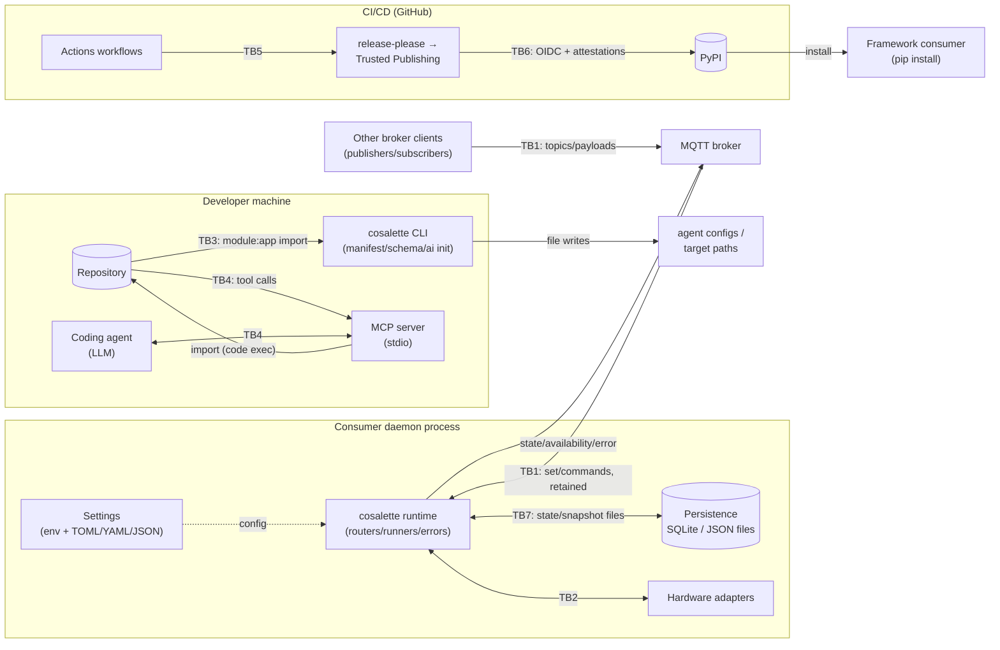

# Threat Model & Security Architecture

**Status:** Living document, maintained per [audit charter](audit-charter.md).
**Last full cycle:** 2026-08 · **Method:** ISO/SAE 21434-inspired TARA adapted to a
software framework · **Scope:** cosalette framework *and* every consumer application
built on it.

---

## 1. System Overview

cosalette is a Python framework for building IoT-to-MQTT bridge daemons. A consumer
application embeds `cosalette.App`, registers telemetry pollers and command handlers
(optionally backed by hardware adapters), and the framework provides MQTT wiring,
structured logging, health/LWT reporting, error publishing, persistence, filtering
(Rust), schema validation, plus developer tooling (Typer CLI, MCP server).

The framework ships to PyPI as wheels (including an abi3 Rust-extension wheel); consumers'
daemons then run against their own MQTT brokers and devices. Two distinct security
postures therefore exist:

| Posture | Principal assets | Adversary examples |
| --- | --- | --- |
| **Runtime (consumer deployment)** | broker traffic, actuators behind handlers, consumer secrets, daemon availability | malicious/compromised broker peer, compromised broker itself, LAN intruder, misbehaving device |
| **Development (repo/tooling)** | developer workstation, agent contexts, CI secrets, published artifacts | malicious repo/PR reviewed by agent, poisoned package/action, leaked token |

## 2. Data-Flow Diagram



## 3. Trust Boundaries

| ID | Boundary | Crossing data | Inherently trusted? |
| --- | --- | --- | --- |
| **TB1** | Broker ⇄ framework data plane | inbound topics + payloads (any publisher the broker admits), retained messages replayed at connect | No — treat every inbound message as attacker-controlled |
| **TB2** | Framework ⇄ hardware adapters / physical world | telemetry values, command side-effects | No — commands crossing TB2 have **physical-world consequences** |
| **TB3** | Repository ⇄ developer tooling (`manifest`, `schema`, scaffolding) | `module:app` spec ⇒ **top-level code execution**, file writes (`ai init`) | Import is code execution *by design* (uvicorn-style); documented in SECURITY.md |
| **TB4** | Coding agent ⇄ MCP server | tool invocations, returned markdown/AST/introspection text (feeds LLM context) | No — prompt-injection surface incl. packaged guidance/ADR content |
| **TB5** | GitHub events ⇄ CI workflows | PR/push payloads interpolated into workflows, caches, artifacts | No — pwn-request/template-injection class |
| **TB6** | CI ⇄ PyPI release path | wheels, provenance/OIDC tokens, attestations | Partially — protected by trusted publishing; verify continuously |
| **TB7** | Consumer host ⇄ framework (settings, config files, persistence) | env vars (**whole-process environment** — no prefix), TOML/YAML/JSON files, SQLite/JSON state files | Partially — files assume host-local attacker absent, but namespace collisions are realistic |

## 4. Assets

| ID | Asset | C | I | A | Notes |
| --- | --- | --- | --- | --- | --- |
| A1 | Command authenticity/integrity (`{prefix}/{device}/set`) | ● | ● | ● | Drives consumer handlers → TB2 physical impact |
| A2 | Telemetry/state on broker topics | ○ | ● | ○ | May disclose occupancy/presence patterns |
| A3 | Error topics (`{prefix}/error`) | ○ | – | – | Deliberate leak valve when `error_publish_verbose=true` |
| A4 | Consumer secrets (MQTT password, TLS key material) | ● | ● | – | `SecretStr`; env/config/log exposure paths |
| A5 | Persistence & snapshot files (SQLite, JSON store, entity snapshot) | ○ | ● | ○ | Retained-cleanup decisions derive from snapshot |
| A6 | Developer workstation / repository integrity | ● | ● | ○ | TB3 import path; `ai init` writes agent configs |
| A7 | Agent context integrity (LLM) | ● | ● | ○ | Tool outputs & packaged guidance feed prompts |
| A8 | CI secrets & workflow integrity | ● | ● | ● | GITHUB_TOKEN scope, OIDC, cache poisoning |
| A9 | Published artifacts (wheels, SBOM, provenance) | ● | ● | ○ | Supply-chain root of trust for all consumers |
| A10 | Daemon availability | – | – | ● | Payload floods, parser exhaustion, reconnect storms |

● primary · ○ secondary · – not applicable

## 5. Entry Points (runtime)

1. MQTT subscription `{prefix}/{device}/set` (incl. JSON sub-dispatch `{...}` payloads)
2. Retained messages replayed by broker at subscribe time (state/availability restore)
3. Process environment (pydantic-settings, **no env prefix**) and config files
   (TOML/YAML/JSON)
4. App-supplied schema definitions (packaged asset + validated refs) and cron expressions
   (registration-time only)
5. Persistence files read at startup (state restore, retained-cleanup snapshot)
6. Developer/MCP entry points: `module:app` specs, `ai init --target`, MCP tool calls

## 6. Threat Scenarios (TARA)

Scoring: likelihood × impact on a 1–5 scale; risk = L×I (≥15 critical/red, 10–14
high/orange, 5–9 medium/yellow, ≤4 low/green). Every scenario maps to CWE IDs and a
treatment (mitigate / transfer / accept / avoid). Finding IDs (`F-*`) reference the
2026-08 audit register (see `audit-report.md` and beads epic `cos-juyi`).

### TB1 — Broker ⇄ framework data plane

| ID | STRIDE | Scenario | CWE | L | I | Risk | Treatment |
| --- | --- | --- | --- | --- | --- | --- | --- |
| S1 | S/T | Broker peer forges commands to `{prefix}/{device}/set`; consumer handler drives physical actuator (TB2) | CWE-345/306 | 3 | 5 | **15** | Mitigate: broker authn+ACL docs (deployment guide); framework cannot authenticate publishers — document explicitly (F-DP7) |
| S2 | T/I | Peer overwrites retained state/availability topics → false device state for subscribers & restore-on-reconnect poisoning | CWE-20 | 3 | 4 | 12 | Mitigate: ACL guidance + retained-trust warning in health docs (F-DP7) |
| S3 | R | Attacker replays recorded command payloads (MQTT QoS ≠ freshness); idempotency is consumer's burden | CWE-294 | 2 | 4 | 8 | Accept + document (protocol-level; consumer guidance) |
| S4 | I | Verbose error publishing leaks paths/hostnames/URL-credentials onto error topics (`error_publish_verbose=true` or via `error_type_map` label/trust conflation) | CWE-209/532 | 3 | 3 | 9 | Mitigate: decouple labeling from message release (F-DP1) |
| S5 | I | Sub-command echo publishes ≤64 attacker-chosen chars (e.g., JWT header prefix) to error topics despite default redaction | CWE-209 | 2 | 2 | 4 | Mitigate: hash-prefix echo instead of raw slice (F-DP2) |
| S6 | D | 256 KiB deeply-nested JSON payload → RecursionError escapes structured error path (no `invalid_json` event); queued-command pile-up | CWE-674/400 | 3 | 3 | 9 | Mitigate: catch RecursionError → InvalidJsonError; depth cap (F-DP4) |
| S7 | D | Hung command handler (default timeout None) stalls entity FIFO worker indefinitely; periodic/device sub-handlers lack timeouts entirely → silent freeze | CWE-400 | 3 | 4 | 12 | Mitigate: bounded default timeout + watchdog (F-DP5) |
| S8 | I | Text-mode log forging via LF in broker-supplied topic names (schema monitor sinks) | CWE-117 | 2 | 2 | 4 | Mitigate: %r/escape in `_schema/_monitor.py` (F-TP3) |
| S9 | I | Heartbeat discloses app version → CVE matching by broker observer | CWE-200 | 2 | 1 | 2 | Mitigate (opt-in omit flag) or accept (F-DP6) |

### TB2 — Framework ⇄ adapters / physical world

| ID | STRIDE | Scenario | CWE | L | I | Risk | Treatment |
| --- | --- | --- | --- | --- | --- | --- | --- |
| S10 | T/I | Malformed/out-of-range telemetry values from misbehaving hardware poison downstream automation (filters reject NaN/±Inf ✓) | CWE-20 | 3 | 4 | 12 | Transfer/mitigate: consumer-side schema enforcement (framework provides it); document adapter duty |
| S11 | T | Raw-payload escape hatches (`Payload(raw=True)`, `payload: str`) deliver broker-controlled bytes into handler logic without validation | CWE-20 | 2 | 4 | 8 | Mitigate: loud security wording at API surface (F-DP8) |

### TB3 — Repository ⇄ developer tooling

| ID | STRIDE | Scenario | CWE | L | I | Risk | Treatment |
| --- | --- | --- | --- | --- | --- | --- | --- |
| S12 | E | `cosalette manifest module:app` executes arbitrary top-level code against untrusted repo (by design, documented) | CWE-94 | 2 | 5 | 10 | Accept w/ documentation (uvicorn-parity); sandbox guidance in SECURITY.md ✓ |
| S13 | E | MCP-suggested scaffold test embeds injected code via unvalidated `dry_run_name`; developer runs generated module | CWE-94 | 2 | 4 | 8 | **Mitigate: validate identifier (F-TP8)** |
| S14 | D | Static-describe AST analyzer exhausted by huge/deeply-nested target file (agent-chosen path) | CWE-400/674 | 2 | 2 | 4 | Mitigate: size cap + RecursionError guard (F-TP7) |

### TB4 — Agent ⇄ MCP server

| ID | STRIDE | Scenario | CWE | L | I | Risk | Treatment |
| --- | --- | --- | --- | --- | --- | --- | --- |
| S15 | T/E | Prompt injection via tool outputs (ADR/guidance markdown, docstrings echoed by static-describe) steers agent into harmful actions with user privileges | CWE-77 | 3 | 4 | 12 | Mitigate: honest residual-exposure documentation; allowlist already deny-by-default (F-TP6); treat as inherent LLM-platform risk |
| S16 | E | Import allowlist bypass (prefix confusion, unicode confusables, case tricks) | CWE-178/184 | 1 | 5 | 5 | Verified refuted — boundary-aware, case-sensitive, pre-import check (F-TP6); keep regression tests |

### TB5 — GitHub events ⇄ CI

| ID | STRIDE | Scenario | CWE | L | I | Risk | Treatment |
| --- | --- | --- | --- | --- | --- | --- | --- |
| S17 | E | pwn-request/template-injection via `${{ github.event.* }}` | CWE-78 | 1 | 5 | 5 | Verified refuted for current workflows (ENV-indirection pattern everywhere; `pull_request_target` limited to closed-type teardown, no checkout) (F-SC3) |
| S18 | T | Fork-PR cache-save pollution | CWE-406 | 1 | 3 | 3 | Mitigate (defense-in-depth): restrict cache saves on PRs (F-SC4) |

### TB6 — CI ⇄ PyPI release path

| ID | STRIDE | Scenario | CWE | L | I | Risk | Treatment |
| --- | --- | --- | --- | --- | --- | --- | --- |
| S19 | T/S | Artifact implant between wheel build & publish | CWE-494 | 1 | 5 | 5 | Mitigated: Trusted Publishing OIDC, PEP 740 attestations, SLSA build-L3 provenance, SBOM attach, TestPyPI canary + human gate (verified strong) |

### TB7 — Consumer host ⇄ framework (env/config/state)

| ID | STRIDE | Scenario | CWE | L | I | Risk | Treatment |
| --- | --- | --- | --- | --- | --- | --- | --- |
| S20 | S/T | Environment squatting: bare `MQTT='{"host":"evil"}'` JSON var overrides whole broker submodel (credential/broker redirect); non-JSON `SCHEMA=public` crashes startup | CWE-15 | 2 | 4 | 8 | **Mitigate: reserved-name guard/error translation + docs (F-TP1)** |
| S21 | T | Tampered snapshot file manipulates retained-cleanup decisions | CWE-345/367 | 1 | 3 | 3 | Verified fail-closed chain (refutation F-DP3); document single-instance-per-(store,prefix) assumption |
| S22 | D | YAML alias bomb via locally-supplied schema file (safe_load does not bound anchors) | CWE-409/770 | 1 | 3 | 3 | Mitigate: alias-expansion cap (F-TP5) |
| S23 | I | PII (emails) committed in tracked beads export `issues.jsonl` | CWE-359 | 3 | 2 | 6 | **Mitigated: scrub + untrack; history rewrite accepted as residual risk (F-SC1)** |

### Cross-cutting

| ID | STRIDE | Scenario | CWE | L | I | Risk | Treatment |
| --- | --- | --- | --- | --- | --- | --- | --- |
| S24 | I | Live tokens in local `.env` invisible to staged-file secret scanners (operational hygiene, never committed) | CWE-798 | – | – | – | Rotate + relocate (user action required) (F-SC2) |

## 7. Attack Trees

**AT1 — Forge commands/state as untrusted publisher (S1/S2)**

```
Goal: drive consumer handler / poison published state via TB1
├─ Compromise broker credentials [out of framework scope]
│  ├─ Plaintext MQTT on LAN (tls=false default) ──► creds sniffable (F-CU1)
│  └─ Anonymous broker (username=None default) ───► open join (F-CU2)
└─ Legitimate-but-overbrokered access
   ├─ No per-prefix ACLs ──────────────────────────► publish any {prefix}/# (docs)
   └─ Wildcards in prefix ──────────────────────────► REFUTED (validate_mqtt_name)
```

**AT2 — Code execution via developer-tool import surface (S12–S16)**

```
Goal: execute attacker code on developer machine
├─ Direct CLI import (manifest/schema) ────────► by-design trust boundary, documented
├─ MCP gated import
│  ├─ Prefix confusion ('myapp_evil') ─────────► REFUTED (boundary-aware match)
│  ├─ Unicode/case confusables ────────────────► REFUTED (fail-closed, verified)
│  └─ Unchecked importer from MCP tools ───────► REFUTED (CLI-only call site)
├─ Generated-code injection ───────────────────► dry_run_name gap (F-TP8, FIX)
└─ Agent-context manipulation → dev runs code ► prompt injection S15 (documented)
```

**AT3 — Supply-chain implant reaching consumers (S19 + P6)**

```
Goal: malicious code in installed wheel
├─ Dependency compromise ──────────────────────► Renovate minReleaseAge, audits; add cargo-deny (F-SC6)
├─ Build/workflow compromise ──────────────────► SHA pinning ✓ least-privilege ✓ cache hygiene (F-SC4)
├─ Publish-path tamper ────────────────────────► OIDC trusted publishing + attestations ✓ human gate ✓
├─ Base image compromise ──────────────────────► digest pinning + weekly Trivy ✓
└─ Typosquatting/social ───────────────────────► out of scope; Scorecard badge pending (F-SC5)
```

## 8. Risk Register Summary

Top risks after treatment planning: **S1 (15, critical)** physical-command forgery —
primary mitigations are deployment-side (broker authn/ACL/TLS) plus closing framework
leak valves; **S2/S7 (12, high)** retained-state spoofing and handler-hang DoS;
**S10/S15 (12, high)** physical-input integrity and agent prompt injection;
**S4/S6/S13/S20 (8–9, medium)** leak valves, recursion DoS, scaffold injection,
env squatting — all receiving 2026-08 fixes. Full register with treatments lives with
the audit report; deferred items are tracked under gate task `cos-juyi.11`.
